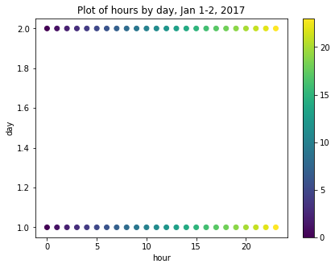

:::::::::::::::::::::::::::::::::::::: questions 

- How do you prepare time-series data for machine learning?

::::::::::::::::::::::::::::::::::::::::::::::::

::::::::::::::::::::::::::::::::::::: objectives

- Extract datetime elements from a Pandas datetime index.

::::::::::::::::::::::::::::::::::::::::::::::::

## Introduction

Machine learning methods can fall into two broad categories

- supervised
- unsupervised.

In both cases, the affect or influence of one or more *features* of an
observation are analyzed to determine their effect on a result. The result
in this case is termed a *label*. In supervised learning techniques, models
are trained using pre-labeled data. The labels in this case act as a ground
truth against which a model's performance can be compared and evaluated.

In an unsupervised learning process, models are trained using data for which
ground truth labels have not been identified. Ground truth in these cases is
determined statistically. 

Throughout this lesson we are going to focus on *unsupervised* machine
learning techniques to forecast power consumption.

## About the code

The code for this and other sections of this lesson is based on time-series
forecasting examples, tutorials, and other documentation available from 
the [TensorFlow](https://github.com/tensorflow/docs/blob/master/README.md) 
project. Per the documentation, materials available from the TensorFlow 
GitHub site published using an 
[Apache 2.0](https://github.com/tensorflow/docs/blob/master/LICENSE)
license.

> Google Inc. (2023) *TensorFlow Documentation.* Retrieved from [https://github.com/tensorflow/docs/blob/master/README.md](https://github.com/tensorflow/docs/blob/master/README.md).

## Features

The data we used in a separate lesson on modeling time-series forecasts, and
which we will continue to use here, include a handful of variables:

- INTERVAL_TIME
- METER_FID
- START_READ
- END_READ
- INTERVAL_READ

In these previous analyses, the only variable used for forecasting power
consumption were INTERVAL_READ and INTERVAL_TIME. Going forward, we can 
capitalize on the efficiency and accuracy of machine learning methods via
*feature engineering*. That is, we want to identify and include as many
time-based features as possible that may be relevant to power consumption.
For example, though some of our previous models accounted for seasonal trends
in the data, other factors that influence power consumption were more 
difficult to include in our models:

- Day of the week
- Business days, weekends, and holidays
- Season

While some of these features were implicit in the data - for example, power
consumption during the US summer notably increased - making these features
explicit in our data can result in more accurate machine learning models, with
more predictive powe.

In this section, we demonstrate a process for extracting these features
from a datetime index. The dataset output at the end of this section will be
used throughout the rest of this lesson for making forecasts.

## Read data

To begin with, import the necessary libraries. We will introduce some 
new libraries in later sections, but here we only need a handful of libraries
to pre-process our daa.

```python
import matplotlib.pyplot as plt
import numpy as np
import pandas as pd
```

Next we read the data, and set and sort the datetime index.

```python
fp = "../../data/ladpu_smart_meter_data_01.csv"
df = pd.read_csv(fp)
df.set_index(pd.to_datetime(df["INTERVAL_TIME"]), inplace=True)
df.sort_index(inplace=True)

print(df.info())
print(df.index)
```

```output
<class 'pandas.core.frame.DataFrame'>
DatetimeIndex: 105012 entries, 2017-01-01 00:00:00 to 2019-12-31 23:45:00
Data columns (total 5 columns):
 #   Column         Non-Null Count   Dtype  
---  ------         --------------   -----  
 0   INTERVAL_TIME  105012 non-null  object 
 1   METER_FID      105012 non-null  int64  
 2   START_READ     105012 non-null  float64
 3   END_READ       105012 non-null  float64
 4   INTERVAL_READ  105012 non-null  float64
dtypes: float64(3), int64(1), object(1)
memory usage: 4.8+ MB
None

DatetimeIndex(['2017-01-01 00:00:00', '2017-01-01 00:15:00',
               '2017-01-01 00:30:00', '2017-01-01 00:45:00',
               '2017-01-01 01:00:00', '2017-01-01 01:15:00',
               '2017-01-01 01:30:00', '2017-01-01 01:45:00',
               '2017-01-01 02:00:00', '2017-01-01 02:15:00',
               ...
               '2019-12-31 21:30:00', '2019-12-31 21:45:00',
               '2019-12-31 22:00:00', '2019-12-31 22:15:00',
               '2019-12-31 22:30:00', '2019-12-31 22:45:00',
               '2019-12-31 23:00:00', '2019-12-31 23:15:00',
               '2019-12-31 23:30:00', '2019-12-31 23:45:00'],
              dtype='datetime64[ns]', name='INTERVAL_TIME', length=105012, freq=None)
```

We will forecasting hourly power consumption in later sections, so we need
to resample the data to an hourly frequency here.

```python
hourly_readings = pd.DataFrame(df.resample("h")["INTERVAL_READ"].sum())
print(hourly_readings.info())
print(hourly_readings.head())
```

```output
<class 'pandas.core.frame.DataFrame'>
DatetimeIndex: 26280 entries, 2017-01-01 00:00:00 to 2019-12-31 23:00:00
Freq: H
Data columns (total 1 columns):
 #   Column         Non-Null Count  Dtype  
---  ------         --------------  -----  
 0   INTERVAL_READ  26280 non-null  float64
dtypes: float64(1)
memory usage: 410.6 KB
None

                     INTERVAL_READ
INTERVAL_TIME                     
2017-01-01 00:00:00         0.3192
2017-01-01 01:00:00         0.3294
2017-01-01 02:00:00         0.3414
2017-01-01 03:00:00         0.3150
2017-01-01 04:00:00         0.3288
```

A plot of the entire dataset is somewhat noisy, though seasonal trends are
apparent.

```python
plot_features = hourly_readings["INTERVAL_READ"]
_ = plot_features.plot()
```


Ploting hourly consumption for the month of January, 2017, is less noisy though
there are no obvious trends in the data.

```python
plot_features = hourly_readings["INTERVAL_READ"][:744]
_ = plot_features.plot()
```


Finally, before manipulating the data we can inspect for anomalies or outliers
using descriptive statistics. Even though we only have a single variable to
describe in our current dataset, the ```transpose()``` method used below is 
useful in cases where you want to tabulate descriptive statistics for 
multiple variables.

```python
print(hourly_readings.describe().transpose())
```

```output
                 count      mean       std  min    25%     50%     75%     max
INTERVAL_READ  26280.0  0.510161  0.651826  0.0  0.153  0.1998  0.5262  6.2604
```

The ```max``` value of 6.2604 may seem like an outlier, considering that 75%
of INTERVAL_READ values are 0.5262 or less. However, a look back up to our first
plot indicates peak power consumption over a relatively short time period in
the middle of the year. For now we will accept this max value as reasonable.

## Add datetime features

Most of the features that we will add to the data are attributes of datetime
objects in Pandas. We can extract them using their attribute names:

```python
print("hour:", hourly_readings.head().index.hour)
print("day of the month:", hourly_readings.head().index.day)
print("day of week:", hourly_readings.head().index.day_of_week)
print("day of year:", hourly_readings.head().index.day_of_year)
print("day name:", hourly_readings.head().index.day_name())
print("week of year:",hourly_readings.head().index.week)
print("month:", hourly_readings.head().index.month)
print("year", hourly_readings.head().index.year)
```

```output
hour: Int64Index([0, 1, 2, 3, 4], dtype='int64', name='INTERVAL_TIME')

day of the month: Int64Index([1, 1, 1, 1, 1], dtype='int64', name='INTERVAL_TIME')

day of week: Int64Index([6, 6, 6, 6, 6], dtype='int64', name='INTERVAL_TIME')

day of year: Int64Index([1, 1, 1, 1, 1], dtype='int64', name='INTERVAL_TIME')

day name: Index(['Sunday', 'Sunday', 'Sunday', 'Sunday', 'Sunday'], dtype='object', name='INTERVAL_TIME')

week of year: Int64Index([52, 52, 52, 52, 52], dtype='int64', name='INTERVAL_TIME')

month: Int64Index([1, 1, 1, 1, 1], dtype='int64', name='INTERVAL_TIME')

year Int64Index([2017, 2017, 2017, 2017, 2017], dtype='int64', name='INTERVAL_TIME')
```

We can add these attributes as new features.

```python

hourly_readings['hour'] = hourly_readings.index.hour
hourly_readings['day_month'] = hourly_readings.index.day
hourly_readings['day_week'] = hourly_readings.index.day_of_week
hourly_readings['day_year'] = hourly_readings.index.day_of_year
hourly_readings['day_name'] = hourly_readings.index.day_name()
hourly_readings['week'] = hourly_readings.index.week
hourly_readings['month'] = hourly_readings.index.month
hourly_readings['year'] = hourly_readings.index.year
hourly_readings['date'] = hourly_readings.index.to_series().apply(lambda x: x.strftime("%Y-%m-%d"))

print(hourly_readings.head())
print(hourly_readings.tail())
```

```output
<class 'pandas.core.frame.DataFrame'>
DatetimeIndex: 26280 entries, 2017-01-01 00:00:00 to 2019-12-31 23:00:00
Freq: H
Data columns (total 10 columns):
 #   Column         Non-Null Count  Dtype  
---  ------         --------------  -----  
 0   INTERVAL_READ  26280 non-null  float64
 1   hour           26280 non-null  int64  
 2   day_month      26280 non-null  int64  
 3   day_week       26280 non-null  int64  
 4   day_year       26280 non-null  int64  
 5   day_name       26280 non-null  object 
 6   week           26280 non-null  int64  
 7   month          26280 non-null  int64  
 8   year           26280 non-null  int64  
 9   date           26280 non-null  object 
dtypes: float64(1), int64(7), object(2)
memory usage: 2.2+ MB
None

                     INTERVAL_READ  hour  day_month  ...  month  year        date
INTERVAL_TIME                                        ...                         
2017-01-01 00:00:00         0.3192     0          1  ...      1  2017  2017-01-01
2017-01-01 01:00:00         0.3294     1          1  ...      1  2017  2017-01-01
2017-01-01 02:00:00         0.3414     2          1  ...      1  2017  2017-01-01
2017-01-01 03:00:00         0.3150     3          1  ...      1  2017  2017-01-01
2017-01-01 04:00:00         0.3288     4          1  ...      1  2017  2017-01-01


[5 rows x 10 columns]
                     INTERVAL_READ  hour  day_month  ...  month  year        date
INTERVAL_TIME                                        ...                         
2019-12-31 19:00:00         5.5914    19         31  ...     12  2019  2019-12-31
2019-12-31 20:00:00         2.4234    20         31  ...     12  2019  2019-12-31
2019-12-31 21:00:00         4.3848    21         31  ...     12  2019  2019-12-31
2019-12-31 22:00:00         2.0952    22         31  ...     12  2019  2019-12-31
2019-12-31 23:00:00         1.7424    23         31  ...     12  2019  2019-12-31
```

Another feature than can influence power consumption is whether a given day
is a business day, a weekend, or a holiday. For our purposes, since our data
only span three years there may not be enough holidays to include those as a
specific feature. However, we can include US federal holidays in a customized
calendar of business days using Pandas' ```holiday``` and ```offsets``` 
methods.

Note that while this example uses the US federal holiday calendar, Pandas
includes holidays and other business day offsets for other regions and locales.

```python
from pandas.tseries.holiday import USFederalHolidayCalendar
from pandas.tseries.offsets import CustomBusinessDay

us_bus = CustomBusinessDay(calendar=USFederalHolidayCalendar())

# Set the business day date range to the start and end dates of our data
us_business_days = pd.bdate_range('2017-01-01', '2019-12-31', freq=us_bus)

hourly_readings["business_day"] = pd.to_datetime(hourly_readings["date"]).isin(us_business_days)
print(hourly_readings.info())
```

```output
<class 'pandas.core.frame.DataFrame'>
DatetimeIndex: 26280 entries, 2017-01-01 00:00:00 to 2019-12-31 23:00:00
Freq: H
Data columns (total 11 columns):
 #   Column         Non-Null Count  Dtype  
---  ------         --------------  -----  
 0   INTERVAL_READ  26280 non-null  float64
 1   hour           26280 non-null  int64  
 2   day_month      26280 non-null  int64  
 3   day_week       26280 non-null  int64  
 4   day_year       26280 non-null  int64  
 5   day_name       26280 non-null  object 
 6   week           26280 non-null  int64  
 7   month          26280 non-null  int64  
 8   year           26280 non-null  int64  
 9   date           26280 non-null  object 
 10  business_day   26280 non-null  bool   
dtypes: bool(1), float64(1), int64(7), object(2)
memory usage: 2.2+ MB
None
```

## Sine and cosine transformation

Finally, we can apply a sine and cosine transformation to some of the datetime
features to more effectively represent the cyclic or periodic nature of 
specific time frequencies.

For example, though we have added an *hour* feature, the data are ordinal. 
That is, the values for each hour go from 1-24 in order, but hours as an
ordinal feature don't express a cyclic relationship relative to the idea that
1:00 AM of a given date is, time-wise, more or less similar to 1:00 AM of the
day before or after. For example, the figure below is a scatter plot of hours 
per day for January 1-2, 2017, in which ordinal hour "values" are plotted
against ordinal day "values." The overlap we might expect from one day
ending and another beginning is not represented.



We can use sine and cosine transformations to add features
that capture this characteristic of time. First, we create a timestamp 
series based on the datetime index.

```python
ts_s = hourly_readings.index.map(pd.Timestamp.timestamp)
print(ts_s)
```

```output
Float64Index([1483228800.0, 1483232400.0, 1483236000.0, 1483239600.0,
              1483243200.0, 1483246800.0, 1483250400.0, 1483254000.0,
              1483257600.0, 1483261200.0,
              ...
              1577800800.0, 1577804400.0, 1577808000.0, 1577811600.0,
              1577815200.0, 1577818800.0, 1577822400.0, 1577826000.0,
              1577829600.0, 1577833200.0],
             dtype='float64', name='INTERVAL_TIME', length=26280)
```

Since timestamps are counted per second, next we want to calculate the number
of timestamps in a day and in a year. These values are then applied to sine
and cosine transformations of each timestamp value. The transformed values are
added as new features to the dataset.

Note that we could use a similar process for weeks, or other datetime elements.

```python
day = 24*60*60
year = (365.2425)*day

hourly_readings['day_sin'] = np.sin(ts_s * (2 * np.pi / day))
hourly_readings['day_cos'] = np.cos(ts_s * (2 * np.pi / day))
hourly_readings['year_sin'] = np.sin(ts_s * (2 * np.pi / year))
hourly_readings['year_cos'] = np.cos(ts_s * (2 * np.pi / year))

print(hourly_readings.info())
```

```output
<class 'pandas.core.frame.DataFrame'>
DatetimeIndex: 26280 entries, 2017-01-01 00:00:00 to 2019-12-31 23:00:00
Freq: H
Data columns (total 15 columns):
 #   Column         Non-Null Count  Dtype  
---  ------         --------------  -----  
 0   INTERVAL_READ  26280 non-null  float64
 1   hour           26280 non-null  int64  
 2   day_month      26280 non-null  int64  
 3   day_week       26280 non-null  int64  
 4   day_year       26280 non-null  int64  
 5   day_name       26280 non-null  object 
 6   week           26280 non-null  int64  
 7   month          26280 non-null  int64  
 8   year           26280 non-null  int64  
 9   date           26280 non-null  object 
 10  business_day   26280 non-null  bool   
 11  day_sin        26280 non-null  float64
 12  day_cos        26280 non-null  float64
 13  year_sin       26280 non-null  float64
 14  year_cos       26280 non-null  float64
dtypes: bool(1), float64(5), int64(7), object(2)
memory usage: 3.0+ MB
None
```

If we now plot the transformed values for January 1-2, 2017, we can see that
the plot has a clock-like appearance and that the values for the different 
hours overlap. In fact, although this is only a plot of the first 48 hours,
we could plot the entire dataset and the plot would look the same.

```plot
fig, ax = plt.subplots(figsize=(7, 5))
sp = ax.scatter(hourly_readings[:48]['day_sin'], 
                hourly_readings[:48]['day_cos'],
                c = hourly_readings[:48]['hour'])
ax.set(
    xlabel="sin(hour)",
    ylabel="cos(hour)",
    title="Plot of hours by day, Jan 1-2, 2017"
)
_ = fig.colorbar(sp)
```


## Export data to CSV

At this point, we have added several datetime features to our dataset using
datetime attributes. We have additionally used these attributes to add sine and
cosine transformed hour features, and a boolean feature indicating whether 
or not any given day in the dataset is a business day.

Rather than redo this process for the remaining sections of this lesson, we
will export the current dataset for later use. The file will be saved to the
data directory referenced in the *Setup* section of this lesson.

```python
hourly_readings.to_csv("../../data/hourly_readings.csv", index=True)
```

::::::::::::::::::::::::::::::::::::: keypoints 

- Use sine and cosine transformations to represent the periodic or
cyclical nature of time-series data.

::::::::::::::::::::::::::::::::::::::::::::::::

