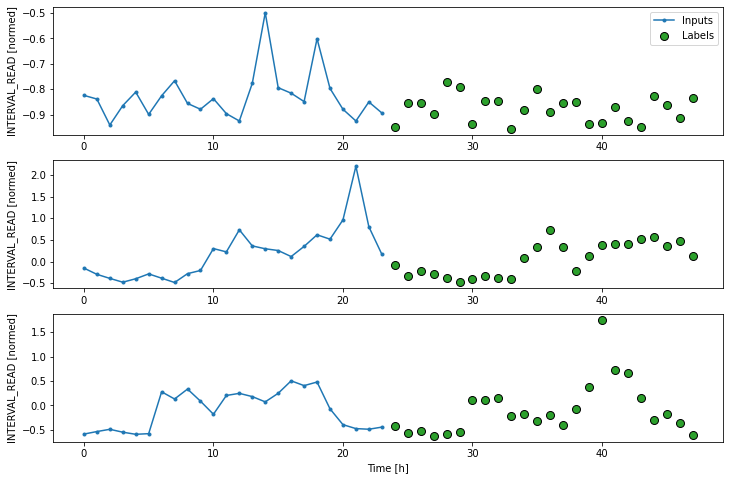
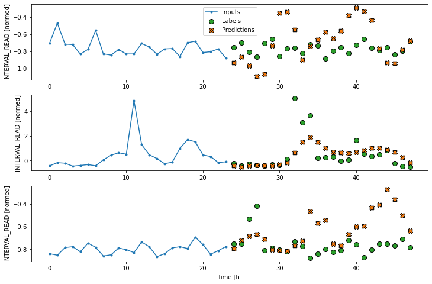
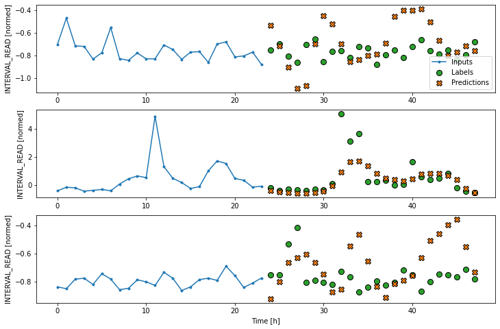

:::::::::::::::::::::::::::::::::::::: questions 

- How can forecast more than one timestep at a time?

::::::::::::::::::::::::::::::::::::::::::::::::

::::::::::::::::::::::::::::::::::::: objectives

- Explain how to create data windows and machine learning pipelines for 
forcasting multiple timesteps.

::::::::::::::::::::::::::::::::::::::::::::::::

## Introduction


## About the code

The code for this and other sections of this lesson is based on time-series
forecasting examples, tutorials, and other documentation available from 
the [TensorFlow](https://github.com/tensorflow/docs/blob/master/README.md) 
project. Per the documentation, materials available from the TensorFlow 
GitHub site published using an 
[Apache 2.0](https://github.com/tensorflow/docs/blob/master/LICENSE)
license.

> Google Inc. (2023) *TensorFlow Documentation.* Retrieved from [https://github.com/tensorflow/docs/blob/master/README.md](https://github.com/tensorflow/docs/blob/master/README.md).


## Set up the environment

As with the previous section, begin by importing libraries, reading data, and
defining the ```WindowGenerator``` class.

```python
import os
import IPython
import IPython.display
import matplotlib as mpl
import matplotlib.pyplot as plt
import numpy as np
import pandas as pd
import seaborn as sns
import tensorflow as tf
```

Read data:

```python
train_df = pd.read_csv("../../data/training_df.csv")
val_df = pd.read_csv("../../data/val_df.csv")
test_df = pd.read_csv("../../data/test_df.csv")

column_indices = {name: i for i, name in enumerate(test_df.columns)}

print(train_df.info())
print(val_df.info())
print(test_df.info())
print(column_indices)
```

```output
<class 'pandas.core.frame.DataFrame'>
RangeIndex: 18396 entries, 0 to 18395
Data columns (total 5 columns):
 #   Column         Non-Null Count  Dtype  
---  ------         --------------  -----  
 0   INTERVAL_READ  18396 non-null  float64
 1   hour           18396 non-null  float64
 2   day_sin        18396 non-null  float64
 3   day_cos        18396 non-null  float64
 4   business_day   18396 non-null  float64
dtypes: float64(5)
memory usage: 718.7 KB
None

<class 'pandas.core.frame.DataFrame'>
RangeIndex: 5256 entries, 0 to 5255
Data columns (total 5 columns):
 #   Column         Non-Null Count  Dtype  
---  ------         --------------  -----  
 0   INTERVAL_READ  5256 non-null   float64
 1   hour           5256 non-null   float64
 2   day_sin        5256 non-null   float64
 3   day_cos        5256 non-null   float64
 4   business_day   5256 non-null   float64
dtypes: float64(5)
memory usage: 205.4 KB
None

<class 'pandas.core.frame.DataFrame'>
RangeIndex: 2628 entries, 0 to 2627
Data columns (total 5 columns):
 #   Column         Non-Null Count  Dtype  
---  ------         --------------  -----  
 0   INTERVAL_READ  2628 non-null   float64
 1   hour           2628 non-null   float64
 2   day_sin        2628 non-null   float64
 3   day_cos        2628 non-null   float64
 4   business_day   2628 non-null   float64
dtypes: float64(5)
memory usage: 102.8 KB
None

{'INTERVAL_READ': 0, 'hour': 1, 'day_sin': 2, 'day_cos': 3, 'business_day': 4}
```

Create the ```WindowGenerator``` class.

```python
class WindowGenerator():
  def __init__(self, input_width, label_width, shift,
               train_df=train_df, val_df=val_df, test_df=test_df,
               label_columns=None):
    # Store the raw data.
    self.train_df = train_df
    self.val_df = val_df
    self.test_df = test_df

    # Work out the label column indices.
    self.label_columns = label_columns
    if label_columns is not None:
      self.label_columns_indices = {name: i for i, name in
                                    enumerate(label_columns)}
    self.column_indices = {name: i for i, name in
                           enumerate(train_df.columns)}

    # Work out the window parameters.
    self.input_width = input_width
    self.label_width = label_width
    self.shift = shift

    self.total_window_size = input_width + shift

    self.input_slice = slice(0, input_width)
    self.input_indices = np.arange(self.total_window_size)[self.input_slice]

    self.label_start = self.total_window_size - self.label_width
    self.labels_slice = slice(self.label_start, None)
    self.label_indices = np.arange(self.total_window_size)[self.labels_slice]


  def __repr__(self):
    return '\n'.join([
        f'Total window size: {self.total_window_size}',
        f'Input indices: {self.input_indices}',
        f'Label indices: {self.label_indices}',
        f'Label column name(s): {self.label_columns}'])


  def split_window(self, features):
    inputs = features[:, self.input_slice, :]
    labels = features[:, self.labels_slice, :]
    if self.label_columns is not None:
      labels = tf.stack(
          [labels[:, :, self.column_indices[name]] for name in self.label_columns],
          axis=-1)

    # Slicing doesn't preserve static shape information, so set the shapes
    # manually. This way the `tf.data.Datasets` are easier to inspect.
    inputs.set_shape([None, self.input_width, None])
    labels.set_shape([None, self.label_width, None])

    return inputs, labels

  
  def plot(self, model=None, plot_col='INTERVAL_READ', max_subplots=3):
    inputs, labels = self.example
    plt.figure(figsize=(12, 8))
    plot_col_index = self.column_indices[plot_col]
    max_n = min(max_subplots, len(inputs))
    for n in range(max_n):
      plt.subplot(max_n, 1, n+1)
      plt.ylabel(f'{plot_col} [normed]')
      plt.plot(self.input_indices, inputs[n, :, plot_col_index],
               label='Inputs', marker='.', zorder=-10)

      if self.label_columns:
        label_col_index = self.label_columns_indices.get(plot_col, None)
      else:
        label_col_index = plot_col_index

      if label_col_index is None:
        continue

      plt.scatter(self.label_indices, labels[n, :, label_col_index],
                  edgecolors='k', label='Labels', c='#2ca02c', s=64)
      if model is not None:
        predictions = model(inputs)
        plt.scatter(self.label_indices, predictions[n, :, label_col_index],
                    marker='X', edgecolors='k', label='Predictions',
                    c='#ff7f0e', s=64)

      if n == 0:
        plt.legend()

    plt.xlabel('Time [h]')
    

  def make_dataset(self, data):
    data = np.array(data, dtype=np.float32)
    ds = tf.keras.utils.timeseries_dataset_from_array(
        data=data,
        targets=None,
        sequence_length=self.total_window_size,
        sequence_stride=1,
        shuffle=True,
        batch_size=32)

    ds = ds.map(self.split_window)

    return ds


  @property
  def train(self):
    return self.make_dataset(self.train_df)

  @property
  def val(self):
    return self.make_dataset(self.val_df)

  @property
  def test(self):
    return self.make_dataset(self.test_df)

  @property
  def example(self):
    """Get and cache an example batch of `inputs, labels` for plotting."""
    result = getattr(self, '_example', None)
    if result is None:
      # No example batch was found, so get one from the `.train` dataset
      result = next(iter(self.train))
      # And cache it for next time
      self._example = result
    return result
```

Create a data window that will forecast 24 timesteps (label_width), 24 hours
into the future (shift), based on 24 hours of history (input_width).

```python
OUT_STEPS = 24
multi_window = WindowGenerator(input_width=24,
                               label_width=OUT_STEPS,
                               shift=OUT_STEPS)

print(multi_window)
```

```output
Total window size: 48
Input indices: [ 0  1  2  3  4  5  6  7  8  9 10 11 12 13 14 15 16 17 18 19 20 21 22 23]
Label indices: [24 25 26 27 28 29 30 31 32 33 34 35 36 37 38 39 40 41 42 43 44 45 46 47]
Label column name(s): None
```

We can plot the window to demonstrate the width of the inputs and labels.

```python
multi_window.plot()
```



Create a naive seasonal baseline that is a subclass of the ```tf.keras.Model```
class. Add a plot.

```python
class RepeatBaseline(tf.keras.Model):
  def call(self, inputs):
    return inputs

repeat_baseline = RepeatBaseline()
repeat_baseline.compile(loss=tf.keras.losses.MeanSquaredError(),
                        metrics=[tf.keras.metrics.MeanAbsoluteError()])

multi_val_performance = {}
multi_performance = {}


multi_val_performance['Repeat'] = repeat_baseline.evaluate(multi_window.val)
multi_performance['Repeat'] = repeat_baseline.evaluate(multi_window.test, verbose=0)

print("Baseline performance against validation data:", multi_val_performance["Repeat"])
print("Baseline performance against test data:", multi_performance["Repeat"])
```

```output
163/163 [==============================] - 1s 3ms/step - loss: 0.4627 - mean_absolute_error: 0.2183
Baseline performance against validation data: [0.46266090869903564, 0.218303844332695]
Baseline performance against test data: [0.5193880200386047, 0.23921075463294983]
```

And the plot:

```python
multi_window.plot(repeat_baseline)
```


As in the previous section, create a function to compile and fit the models.

```python
MAX_EPOCHS = 20

def compile_and_fit(model, window, patience=2):
  early_stopping = tf.keras.callbacks.EarlyStopping(monitor='val_loss',
                                                    patience=patience,
                                                    mode='min')

  model.compile(loss=tf.keras.losses.MeanSquaredError(),
                optimizer=tf.keras.optimizers.Adam(),
                metrics=[tf.keras.metrics.MeanAbsoluteError()])

  history = model.fit(window.train, epochs=MAX_EPOCHS,
                      validation_data=window.val,
                      callbacks=[early_stopping])
  return history
```

For this lesson we will be fitting and evaluating single shot models.

## Multi step linear

```python
num_features = train_df.shape[1]

multi_linear_model = tf.keras.Sequential([
    tf.keras.layers.Lambda(lambda x: x[:, -1:, :]),
    tf.keras.layers.Dense(OUT_STEPS*num_features,
                          kernel_initializer=tf.initializers.zeros()),
    tf.keras.layers.Reshape([OUT_STEPS, num_features])
])

history = compile_and_fit(multi_linear_model, multi_window)

multi_val_performance['Linear'] = multi_linear_model.evaluate(multi_window.val)
multi_performance['Linear'] = multi_linear_model.evaluate(multi_window.test, verbose=0)

print("Linear performance against validation data:", multi_val_performance["Linear"])
print("Linear performance against test data:", multi_performance["Linear"])
```

```output
Epoch 10/20
574/574 [==============================] - 1s 1ms/step - loss: 0.3417 - mean_absolute_error: 0.2890 - val_loss: 0.3035 - val_mean_absolute_error: 0.2805
163/163 [==============================] - 0s 929us/step - loss: 0.3035 - mean_absolute_error: 0.2805
Linear performance against validation data: [0.30350184440612793, 0.28051623702049255]
Linear performance against test data: [0.339562326669693, 0.28846967220306396]
```

And plot:

```python
multi_window.plot(multi_linear_model)
```


## Dense neural network


```python
multi_dense_model = tf.keras.Sequential([
    tf.keras.layers.Lambda(lambda x: x[:, -1:, :]),
    tf.keras.layers.Dense(512, activation='relu'),
    tf.keras.layers.Dense(OUT_STEPS*num_features,
                          kernel_initializer=tf.initializers.zeros()),
    tf.keras.layers.Reshape([OUT_STEPS, num_features])
])

history = compile_and_fit(multi_dense_model, multi_window)

multi_val_performance['Dense'] = multi_dense_model.evaluate(multi_window.val)
multi_performance['Dense'] = multi_dense_model.evaluate(multi_window.test, verbose=0)

print("Dense performance against validation data:", multi_val_performance["Dense"])
print("Dense performance against test data:", multi_performance["Dense"])
```

```output
Epoch 19/20
574/574 [==============================] - 3s 5ms/step - loss: 0.2305 - mean_absolute_error: 0.1907 - val_loss: 0.2058 - val_mean_absolute_error: 0.1846
163/163 [==============================] - 1s 3ms/step - loss: 0.2058 - mean_absolute_error: 0.1846
Dense performance against validation data: [0.2058122605085373, 0.184647798538208]
Dense performance against test data: [0.22725100815296173, 0.19131870567798615]
```

And plot:

```python
multi_window.plot(multi_dense_model)
```



## Convolution neural network

```python
CONV_WIDTH = 3
multi_conv_model = tf.keras.Sequential([
    tf.keras.layers.Lambda(lambda x: x[:, -CONV_WIDTH:, :]),
    tf.keras.layers.Conv1D(256, activation='relu', kernel_size=(CONV_WIDTH)),
    tf.keras.layers.Dense(OUT_STEPS*num_features,
                          kernel_initializer=tf.initializers.zeros()),
    tf.keras.layers.Reshape([OUT_STEPS, num_features])
])

history = compile_and_fit(multi_conv_model, multi_window)

multi_val_performance['Conv'] = multi_conv_model.evaluate(multi_window.val)
multi_performance['Conv'] = multi_conv_model.evaluate(multi_window.test, verbose=0)

print("CNN performance against validation data:", multi_val_performance["Conv"])
print("CNN performance against test data:", multi_performance["Conv"])
```

```output
Epoch 17/20
574/574 [==============================] - 1s 2ms/step - loss: 0.2273 - mean_absolute_error: 0.1913 - val_loss: 0.2004 - val_mean_absolute_error: 0.1791
163/163 [==============================] - 0s 1ms/step - loss: 0.2004 - mean_absolute_error: 0.1791
CNN performance against validation data: [0.20042525231838226, 0.17912138998508453]
CNN performance against test data: [0.2245914489030838, 0.18907274305820465]
```

And plot:

```python
multi_window.plot(multi_conv_model)
```


## Recurrent neural network (LSTM)

```python
multi_lstm_model = tf.keras.Sequential([
    tf.keras.layers.LSTM(32, return_sequences=False),
    tf.keras.layers.Dense(OUT_STEPS*num_features,
                          kernel_initializer=tf.initializers.zeros()),
    tf.keras.layers.Reshape([OUT_STEPS, num_features])
])

history = compile_and_fit(multi_lstm_model, multi_window)


multi_val_performance['LSTM'] = multi_lstm_model.evaluate(multi_window.val)
multi_performance['LSTM'] = multi_lstm_model.evaluate(multi_window.test, verbose=0)

print("LSTM performance against validation data:", multi_val_performance["LSTM"])
print("LSTM performance against test data:", multi_performance["LSTM"])
```

```ouput
Epoch 20/20
574/574 [==============================] - 5s 9ms/step - loss: 0.1990 - mean_absolute_error: 0.1895 - val_loss: 0.1760 - val_mean_absolute_error: 0.1786
163/163 [==============================] - 1s 3ms/step - loss: 0.1760 - mean_absolute_error: 0.1786
LSTM performance against validation data: [0.17599913477897644, 0.17859137058258057]
LSTM performance against test data: [0.19873034954071045, 0.18935032188892365]
```

And plot:

```python
multi_window.plot(multi_lstm_model)
```



## Evaluate

```python
for name, value in multi_performance.items():
  print(f'{name:8s}: {value[1]:0.4f}')
```

```output
Repeat  : 0.2392
Linear  : 0.2885
Dense   : 0.1913
Conv    : 0.1891
LSTM    : 0.1894
```

Plot MAE on validation and test dataframes.

```python
x = np.arange(len(multi_performance))
width = 0.3

metric_name = 'mean_absolute_error'
metric_index = multi_lstm_model.metrics_names.index('mean_absolute_error')
val_mae = [v[metric_index] for v in multi_val_performance.values()]
test_mae = [v[metric_index] for v in multi_performance.values()]

plt.bar(x - 0.17, val_mae, width, label='Validation')
plt.bar(x + 0.17, test_mae, width, label='Test')
plt.xticks(ticks=x, labels=multi_performance.keys(),
           rotation=45)
plt.ylabel(f'MAE (average over all times and outputs)')
_ = plt.legend()
```


::::::::::::::::::::::::::::::::::::: keypoints 

- If a *label_columns* argument is not provided, the data window will 
forecast all features.

::::::::::::::::::::::::::::::::::::::::::::::::

