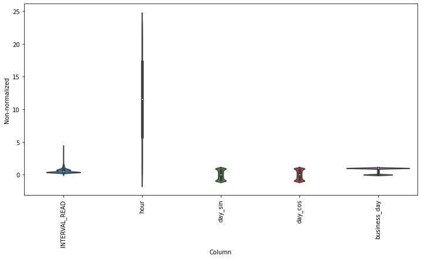
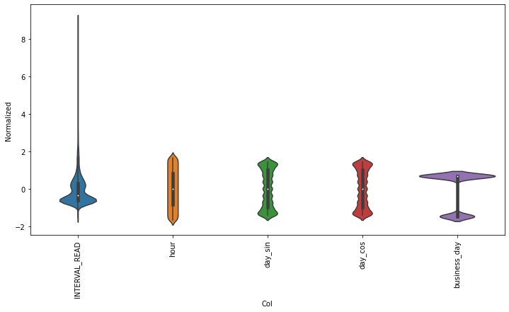
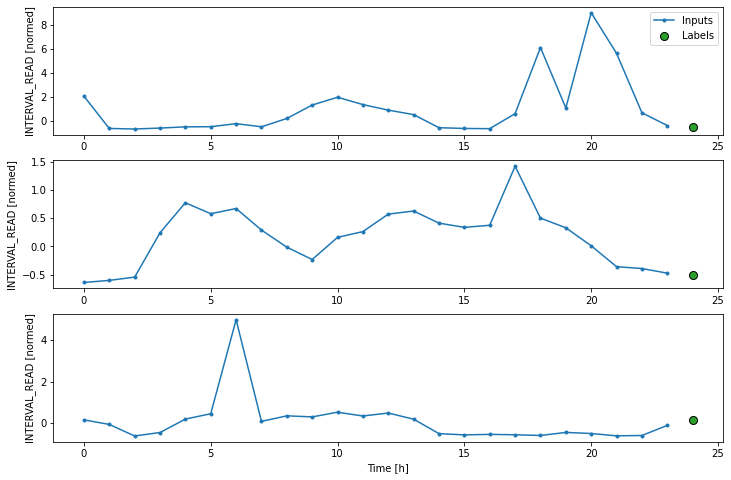

:::::::::::::::::::::::::::::::::::::: questions 

- How do we prepare time-series datasets for machine learning?

::::::::::::::::::::::::::::::::::::::::::::::::

::::::::::::::::::::::::::::::::::::: objectives

- Explain data windows and dataset slicing with TensorFlow.
- Create training, validation, and test datasets for analysis.

::::::::::::::::::::::::::::::::::::::::::::::::

## Introduction

Before making forecasts with our time-series data, we need to create
training, validation, and test datasets. While this process is similar to that
which was demonstrated in a previous lesson on the SARIMAX model, in addition
to adding a validation dataset, a key difference with unsupervised machine 
learning is the definition of *data windows.* 

Returning to our earlier definition of features and labels, a data window
defines the attributes of a slice or batch of features and labels from a
dataset that are the inputs to a machine learning process. These
attributes specify:

- the number of time steps in the slice
- the number of time steps which are inputs and labels
- the time step offset between inputs and labels
- input and label features.

As we will see in later sections, data windows can be used to make both
single and multi-step forecasts. They can also be used to predict one or
more labels, though that will not be covered in this lesson since our primary
focus is forecasting a single feature within our time-series: power consumption.

In this section, we will create training, validation, and test datasets using
normalized data. We will then progressively build and demonstrate a class
for creating data windows and datasets. 

## About the code

The code for this and other sections of this lesson is based on time-series
forecasting examples, tutorials, and other documentation available from 
the [TensorFlow](https://github.com/tensorflow/docs/blob/master/README.md) 
project. Per the documentation, materials available from the TensorFlow 
GitHub site published using an 
[Apache 2.0](https://github.com/tensorflow/docs/blob/master/LICENSE)
license.

> Google Inc. (2023) *TensorFlow Documentation.* Retrieved from [https://github.com/tensorflow/docs/blob/master/README.md](https://github.com/tensorflow/docs/blob/master/README.md).


## Read and split data

First, import the necessary libraries.

```python
import os
import matplotlib as mpl
import matplotlib.pyplot as plt
import numpy as np
import pandas as pd
import seaborn as sns
import tensorflow as tf
```

In the previous section of this lesson, we extracted multiple datetime
attributes in order to add relevant features to our dataset. In the course
of developing this lesson, multiple combinations of features were tested
against different models to determine which combination provides the best
performance without overfitting the models. The features we will use are

- INTERVAL_READ
- hour
- day_sin
- day_cos
- business_day

We will keep these features in our pre-processed smart meter dataset, but
drop them after reading the data. You are encouraged to test different
combinations of features against our models!


```python
df = pd.read_csv('../../data/hourly_readings.csv')
drop_cols = ["INTERVAL_TIME", "date", "month", "day_month", "day_week"]
df.drop(drop_cols, axis=1, inplace=True)
print(df.info())
print(df.head())
```

```output
<class 'pandas.core.frame.DataFrame'>
RangeIndex: 26280 entries, 0 to 26279
Data columns (total 5 columns):
 #   Column         Non-Null Count  Dtype  
---  ------         --------------  -----  
 0   INTERVAL_READ  26280 non-null  float64
 1   hour           26280 non-null  int64  
 2   day_sin        26280 non-null  float64
 3   day_cos        26280 non-null  float64
 4   business_day   26280 non-null  int64  
dtypes: float64(3), int64(2)
memory usage: 1.0 MB
None


   INTERVAL_READ  hour       day_sin   day_cos  business_day
0         1.4910     0  2.504006e-13  1.000000             0
1         0.3726     1  2.588190e-01  0.965926             0
2         0.3528     2  5.000000e-01  0.866025             0
3         0.3858     3  7.071068e-01  0.707107             0
4         0.4278     4  8.660254e-01  0.500000             0
```

Next, we split the dataset into training, validation, and test sets. The
size of the training data will be 70% of the source data. The sizes of the 
validation and test datasets will be 20% and 10% of the source data,
respectively.

It is not unusual when creating training, validation, and test datasets to
randomly shuffle the data before splitting. In the case of time-series, we do
not do this because in order to make meaningful forecasts it is important to
maintain the order of the data.

```python
n = len(df)
train_df = df[0:int(n*0.7)]
val_df = df[int(n*0.7): int(n*0.9)]
test_df = df[int(n*0.9):]

print("Training length:", len(train_df))
print("Validation length:", len(val_df))
print("Test length:", len(test_df))
```

```output
Training length: 18396
Validation length: 5256
Test length: 2628
```

## Scale the data

Scaling the data normalizes the distributions of values across features. This
allows for more efficient modeling. We can see the effect of normalizing the
data by plotting the distribution before and after scaling.

```python
df_non = df.copy()
df_non = df_non.melt(var_name='Column', value_name='Non-normalized')

plt.figure(figsize=(12, 6))
ax = sns.violinplot(x='Column', y='Non-normalized', data=df_non)
_ = ax.set_xticklabels(df.keys(), rotation=90)
```



We scale the data by subtracting the mean of the training data and then
dividing the result by the standard deviation of the training data. Rather
than create new dataframes, we will overwrite the existing source data with
the normalized values.

```python
train_mean = train_df.mean()
train_std = train_df.std()

train_df = (train_df - train_mean) / train_std
val_df = (val_df - train_mean) / train_std
test_df = (test_df - train_mean) / train_std
```

Plotting the scaled data demonstrates the normalized distributions.

```python
df_std = (df - train_mean) / train_std
df_std = df_std.melt(var_name='Col', value_name='Normalized')
plt.figure(figsize=(12, 6))
ax = sns.violinplot(x='Col', y='Normalized', data=df_std)
_ = ax.set_xticklabels(df.keys(), rotation=90)
```



Rather than go through the process of reading, splitting, and normalizing the
data in each section of this lesson, let's save the training, validation, and
test datasets for later use.

```python
train_df.to_csv("../../data/training_df.csv", index=False)
val_df.to_csv("../../data/val_df.csv", index=False)
test_df.to_csv("../../test_df.csv", index=False)
```

## Instantiate data windows

As briefly described above, data windows are slices of the training dataset
that are passed to a machine learning model for fitting and evaluation. Below,
we define a ```WindowGenerator``` class that is capable of flexible window
and dataset creation and which we will apply later to both single and multi-
step forecasts. 

The ```WindowGenerator``` code as provided here is as given in Google's 
TensorFlow documentation, referenced above.

Because windows are slices of a dataset, it is necessary to determine the index
positions of the rows that will be included in a window. The necessary
class attributes are defined in the initialization function of the class:

- *input_width* is the width or number of timesteps to use as the history
of previous values on which a forecast is based
- *label_width* is the number of timesteps that will be forecast
- *shift* defines how many timesteps ahead a forecast is being made

The training, validation, and test dataframes created above are passed as
default arguments when a ```WindowGenerator``` object is instantiated. This
allows the object to access the data without having to specify which datasets
to use every time a new data window is created or a model is fitted. 

Finally, an optional keyword argument, *label_columns,* allows us to identify
which features are being modeled. It is possible to forecast more than one 
feature, but as noted above that is beyond the scope of this lesson. Note that
it is possible to instantiate a data window without specifying the features
that will be predicted.

```python
class WindowGenerator():
  def __init__(self, input_width, label_width, shift,
               train_df=train_df, val_df=val_df, test_df=test_df,
               label_columns=None):
    # Make the raw data available to the data window.
    self.train_df = train_df
    self.val_df = val_df
    self.test_df = test_df

    # Get the column index positions of the label features.
    self.label_columns = label_columns
    if label_columns is not None:
      self.label_columns_indices = {name: i for i, name in
                                    enumerate(label_columns)}
    self.column_indices = {name: i for i, name in
                           enumerate(train_df.columns)}

    # Get the row index positions of the full window, the inputs,
    # and the label(s).
    self.input_width = input_width
    self.label_width = label_width
    self.shift = shift

    self.total_window_size = input_width + shift

    self.input_slice = slice(0, input_width)
    self.input_indices = np.arange(self.total_window_size)[self.input_slice]

    self.label_start = self.total_window_size - self.label_width
    self.labels_slice = slice(self.label_start, None)
    self.label_indices = np.arange(self.total_window_size)[self.labels_slice]

  def __repr__(self):
    return '\n'.join([
        f'Total window size: {self.total_window_size}',
        f'Input indices: {self.input_indices}',
        f'Label indices: {self.label_indices}',
        f'Label column name(s): {self.label_columns}'])
```

Aside from storing the raw data as an attribute of the data window, the class
as defined so far doesn't directly interect with the data. As noted in the
comments to the code, the *__init__* function primarily creates arrays of
column and row index positions that will be used to slice the data into the
appropriate window size. 

We can demonstrate this by instantiating the data window we will use later to
make single-step forecasts. Recalling that our data were re-sampled to an hourly
frequency, we want to define a data window that will forecast one hour into the
future (one timestep ahead) based on the prior 24 hours of power consumption.

Referring to our definitions of input_width, label_width, and shift above, our
window will include the following arguments:

- *input_width* of 24 timesteps, representing the 24 hours of history or prior
power consumption
- *label_width* of 1, since we are forecasting a single timestep, and
- *shift* of 1 since that timestep is one hour into the future beyond the 24
input timesteps.

Since we are forecasting power consumption, the *INTERVAL_READ* feature is our
label column.

```python
# single prediction (label width), 1 hour into future (shift) 
# with 24h history (input width)
# forecasting "INTERVAL_READ"

ts_w1 = WindowGenerator(input_width = 24, 
                       label_width = 1, 
                       shift = 1, 
                       label_columns=["INTERVAL_READ"])

print(ts_w1)
```

```output
Total window size: 25
Input indices: [ 0  1  2  3  4  5  6  7  8  9 10 11 12 13 14 15 16 17 18 19 20 21 22 23]
Label indices: [24]
Label column name(s): ['INTERVAL_READ']
```

The output above indicates that the data window just created will include 25
timesteps, with input row index position offsets of 0-23 and a label row index
position offset of 24. Whichever models are fitted using this window will 
predict the value of the *INTERVAL_READ* feature for the row with the index 
position offset indicated by the label indices.

It is important to note that these arrays are index position offsets, and not
index positions. As such, we can specify any row position index number of the 
training data to use as the first timestep in a data window and the window
will be subset to the correct size using the offset row index positions. Our
next function that we will define for the ```WindowGenerator``` class does
just this.

```python
# split a list of consecutive inputs into correct window size
def split_window(self, features):
  inputs = features[:, self.input_slice, :]
  labels = features[:, self.labels_slice, :]
  if self.label_columns is not None:
    labels = tf.stack(
        [labels[:, :, self.column_indices[name]] for name in self.label_columns],
        axis=-1)

  # Reset the shape of the slices.
  inputs.set_shape([None, self.input_width, None])
  labels.set_shape([None, self.label_width, None])

  return inputs, labels

# Add this function to the WindowGenerator class.
WindowGenerator.split_window = split_window
```

As briefly noted in the comment to the code above, the ```split_window()```
function takes a *stack* of slices of the training data and splits them into
input rows and label rows of the correct sizes as specified by the
input_width and label_width atttributes of the *ts_w1* ```WindowGenerator```
object created above. 

A *stack* in this case is a TensorFlow object that consists of a list of 
Numpy arrays. The stack is passed to the ```split_window()``` function through
the *features* argument, as demonstrated in the next code block.

Keep in mind that within the training data, there are no rows or features that
have been designated yet as inputs or labels. Instesd, for each slice of the
training data included in the stack, the ```split_window()``` function makes
this split, per slice, and exposes the appropriate subset of rows to the 
data window object as either inputs or labels.

```python
# Stack three slices, the length of the total window.
example_window = tf.stack([np.array(train_df[:ts_w1.total_window_size]),
                           np.array(train_df[100:100+ts_w1.total_window_size]),
                           np.array(train_df[200:200+ts_w1.total_window_size])])

example_inputs, example_labels = ts_w1.split_window(example_window)

print('All shapes are: (batch, time, features)')
print(f'Window shape: {example_window.shape}')
print(f'Inputs shape: {example_inputs.shape}')
print(f'Labels shape: {example_labels.shape}')
```

```output
All shapes are: (batch, time, features)
Window shape: (3, 25, 5)
Inputs shape: (3, 24, 5)
Labels shape: (3, 1, 1)
```

The output above indicates that a data window consisting of three batches of
25 timesteps has been created. The window includes 5 features, which is the
number of features in the training data, including the *INTERVAL_READ* feature
that is being predicted.

The output further indicates that the window has been split into three batches
of inputs and labels. Each input batch consists of 24 timesteps and 5 features. 
Each label batch consists of 1 timestep and 1 feature, which is the 
*INTERVAL_READ* feature that is being forecast. Recall that the number of
timesteps included in the input and label batches were defined using the
input_width and label_width arguments when the data window was instantiated.

We can further demonstrate this by plotting timesteps using example data.
The next code block adds a plotting function to the
```WindowGenerator``` class. 

```python
def plot(self, model=None, plot_col='INTERVAL_READ', max_subplots=3):
  inputs, labels = self.example
  plt.figure(figsize=(12, 8))
  plot_col_index = self.column_indices[plot_col]
  max_n = min(max_subplots, len(inputs))
  for n in range(max_n):
    plt.subplot(max_n, 1, n+1)
    plt.ylabel(f'{plot_col} [normed]')
    plt.plot(self.input_indices, inputs[n, :, plot_col_index],
             label='Inputs', marker='.', zorder=-10)

    if self.label_columns:
      label_col_index = self.label_columns_indices.get(plot_col, None)
    else:
      label_col_index = plot_col_index

    if label_col_index is None:
      continue

    plt.scatter(self.label_indices, labels[n, :, label_col_index],
                edgecolors='k', label='Labels', c='#2ca02c', s=64)
    if model is not None:
      predictions = model(inputs)
      plt.scatter(self.label_indices, predictions[n, :, label_col_index],
                  marker='X', edgecolors='k', label='Predictions',
                  c='#ff7f0e', s=64)

    if n == 0:
      plt.legend()

  plt.xlabel('Time [h]')

# Add the plot function to the WindowGenerator class
WindowGenerator.plot = plot
```

Because the ```plot()``` function is added to the ```WindowGenerator``` class,
all of the attributes and methods of the class are exposed to the function.
This means that the plot will be rendered correctly without requiring further
specification of which timesteps are inputs and which are labels. The plot
legend attributes are handled dynamically as well as retrieval of predictions
or forecasts from a model when one is specified.

Layers for inputs, labels, and predictions are added to the plot. In the
example below we are only plotting the actual values of the input timesteps
and the label timesteps from the slices of training data as defined and split
above. We have not modeled any forecasts yet, so no predictions will be 
plotted.

```python
# note this is plotting existing values - a set of inputs and
# one "label" or known value that will be compared with a prediction
ts_w1.example = example_inputs, example_labels
ts_w1.plot()
```



## Make time-series dataset

Our class so far includes flexible, scalable methods for creating data windows
and splitting batches of data windows into input and label timesteps. We have
demonstrated these methods using a stack of three slices of data from our
training data, but as we evaluate models we want to fit them on all of the
data. 

The final function that we are adding to the ```WindowGenerator``` class
does this by creating TensorFlow time-series datasets from each of our
training, validation, and test dataframes. The code is provided below, along
with definitions of some properties that are necessary to actually run models
against the data.

```python
def make_dataset(self, data):
  data = np.array(data, dtype=np.float32)
  ds = tf.keras.utils.timeseries_dataset_from_array(
      data=data,
      targets=None,
      sequence_length=self.total_window_size,
      sequence_stride=1,
      shuffle=True,
      batch_size=32,)

  ds = ds.map(self.split_window)

  return ds

WindowGenerator.make_dataset = make_dataset

@property
def train(self):
  return self.make_dataset(self.train_df)

@property
def val(self):
  return self.make_dataset(self.val_df)

@property
def test(self):
  return self.make_dataset(self.test_df)

@property
def example(self):
  """Get and cache an example batch of `inputs, labels` for plotting."""
  result = getattr(self, '_example', None)
  if result is None:
    # No example batch was found, so get one from the `.train` dataset
    result = next(iter(self.train))
    # And cache it for next time
    self._example = result
  return result

WindowGenerator.train = train
WindowGenerator.val = val
WindowGenerator.test = test
WindowGenerator.example = example
```

This is a lot of code! In this case it may be most helpful to work up from
the properties. The ```example()``` function selects a small batch of inputs
and labels for plotting from among the total set of batches fitted and 
evaluated by a model. This is essentially a subset similar to the example 
plotted above, with the important difference that above the total set of 
batches plotted was the same as the total set of batches in the example. 
Going forward, the total set of  batches evaluated by our models may be much 
larger since the models are being run against the entire dataset. The example 
batches used for plotting may only be a small subset of the total number 
of batches evaluated.

The other properties call the ```make_dataset()``` function on the training,
validation, and test data that are exposed to the ```WindowGenerator``` 
as arguments of the ```__init__()``` function.

Finally, the ```make_dataset()``` function splits the entire training, 
validation, and test dataframes into batches of data windows with the number
of input and label timesteps defined when the data window was instantiated. Each
batch consists of up to 32 slices of the source dataframe, with the starting index
position of each slice progressing (or sliding) by one timestep from the
ending index position of the previous slice. 

When the code above was executed, the properties were added to the
```WindowGenerator``` class. As a result, the ```train()```, ```val()``` and
```test()``` functions were called on the training, validation, and test 
dataframes. In short, having completed the class definition we are now ready
to fit and evalute models on the smart meter data without any further
processing required. We will do that in the next section, but first we can
inspect the result of the data processing performed by the ```WindowGenerator```
class.

Recalling that the ```make_dataset()``` function splits a dataframe into
batches of 32 slices per batch, we can use the ```len()``` function to find
out how many batches the training data have been split into.

```python
print("Length of training data:", len(train_df))
print("Number of batches in train time-series dataset:", len(ts_w1.train))
print("Number of batches times batch size (32):", len(ts_w1.train)*32)
```

```output
Length of training data: 18396
Number of batches in train time-series dataset: 575
Number of batches times batch size (32): 18400
```

The output above suggests that our training data was split into 574 batches of
32 slices each, with a final batch of 4 slices. We can check this by getting
the shapes of the inputs and labels of the first and last batch.

```python
for example_inputs, example_labels in ts_w1.train.take(1):
  print(f'Inputs shape (batch, time, features): {example_inputs.shape}')
  print(f'Labels shape (batch, time, features): {example_labels.shape}')
```

```output
Inputs shape (batch, time, features): (32, 24, 5)
Labels shape (batch, time, features): (32, 1, 1)
```

Note the code below prints out the shapes of all the batches. The output as
provided is only that of the last two batches.

```python
for example_inputs, example_labels in ts_w1.train.take(575):
  print(f'Inputs shape (batch, time, features): {example_inputs.shape}')
  print(f'Labels shape (batch, time, features): {example_labels.shape}')
```

```output
...
Inputs shape (batch, time, features): (32, 24, 5)
Labels shape (batch, time, features): (32, 1, 1)
Inputs shape (batch, time, features): (4, 24, 5)
Labels shape (batch, time, features): (4, 1, 1)
```

This section has been a lot of detail and code, and we haven't run models yet
but the effort will be worth it when we get to forecasting. Many powerful machine 
learning models are built into TensorFlow, but understanding how data windows
and time-series datasets are parsed is key to understanding how later parts
of a machine learning pipeline work. Coming up next - single step forecasts
using the data windows and datasets defined here!


::::::::::::::::::::::::::::::::::::: keypoints 

- Data windows enable single and multi-step time-series forecasting.

::::::::::::::::::::::::::::::::::::::::::::::::

