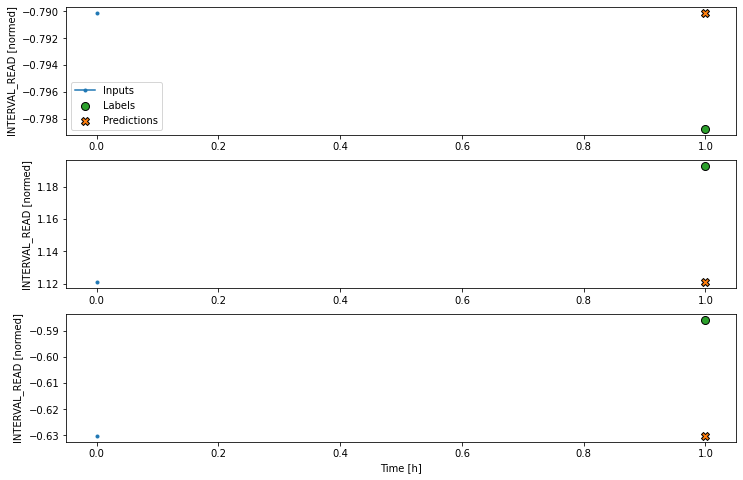
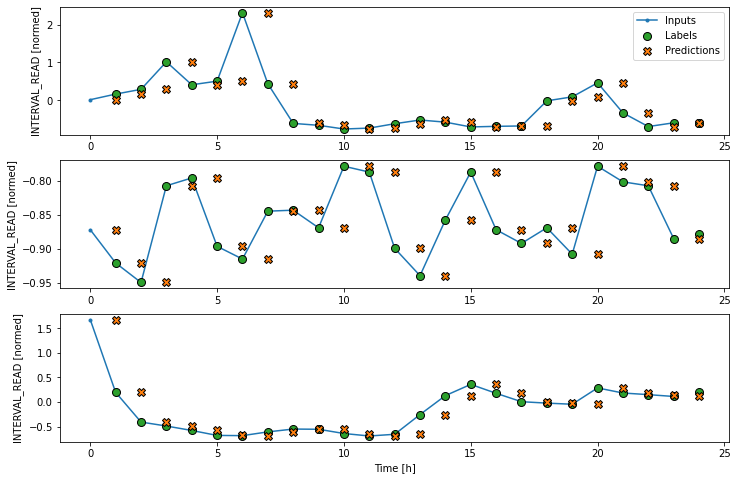
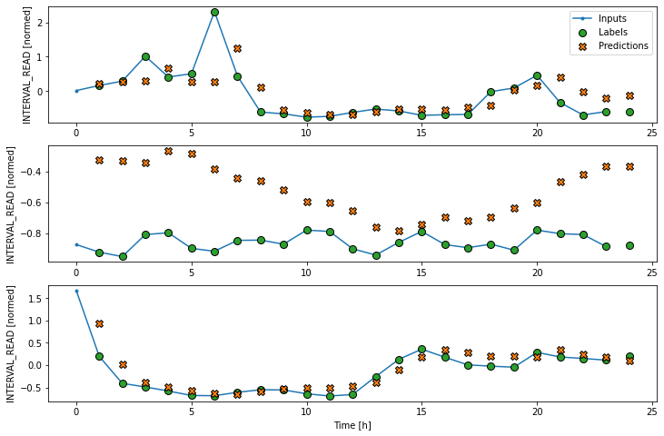
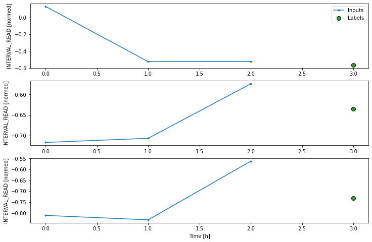
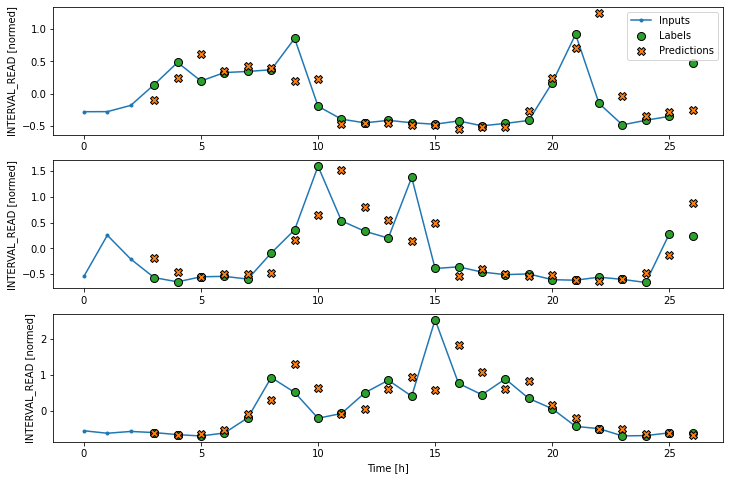
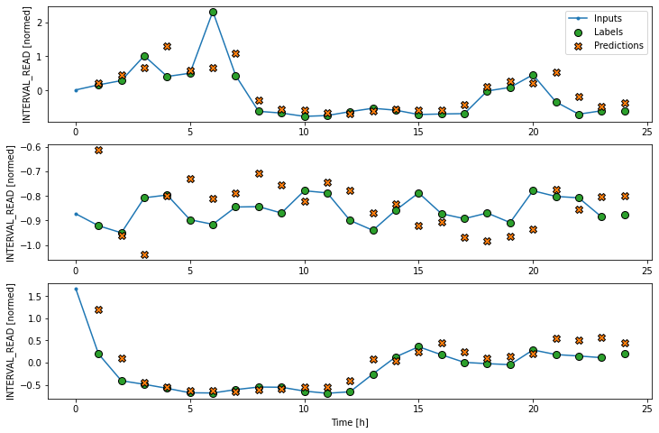
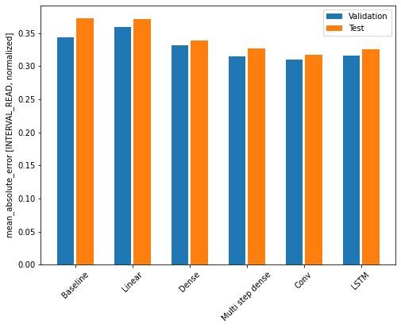

:::::::::::::::::::::::::::::::::::::: questions 

- How do we forecast one timestep in a time-series?

::::::::::::::::::::::::::::::::::::::::::::::::

::::::::::::::::::::::::::::::::::::: objectives

- Explain how to create machine learning pipelines in ```TensorFlow``` 
using the ```keras``` API.

::::::::::::::::::::::::::::::::::::::::::::::::

## Introduction

The previous section introduced the concept of data windows, and how they
can be defined as a first step in a machine learning pipeline. Once data
windows have been defined, time-series datasets can be created which 
consist of batches of consecutive slices of the raw data we want to model
and make predictions with. Data windows not only determine the size of each
slice, but also which data columns should be treated by the machine learning
process as features or inputs, and which columns should be treated as labels
or predicted values. 

Throughout this section, we will introduce some of the time-series modeling
methods available from Google's ```TensorFlow``` library. We will fit and
evaluate several models, each of which demonstrates the structure of machine
learning pipelines using the ```keras``` API.

## About the code

The code for this and other sections of this lesson is based on time-series
forecasting examples, tutorials, and other documentation available from 
the [TensorFlow](https://github.com/tensorflow/docs/blob/master/README.md) 
project. Per the documentation, materials available from the TensorFlow 
GitHub site published using an 
[Apache 2.0](https://github.com/tensorflow/docs/blob/master/LICENSE)
license.

> Google Inc. (2023) *TensorFlow Documentation.* Retrieved from [https://github.com/tensorflow/docs/blob/master/README.md](https://github.com/tensorflow/docs/blob/master/README.md).


## Set up the environment

In the previous section, we saved training, validation, and test datasets
that are ready to be used in our pipeline. We also wrote a lengthy 
```WindowGenerator``` class that handles the data windowing and also creates
time-series datasets out of the training, validation, and test data. 

We will reuse these files and code. For the class to load correctly, the 
datasets need to be read first.

Start by importing libraries.

```python
import os
import IPython
import IPython.display
import matplotlib as mpl
import matplotlib.pyplot as plt
import numpy as np
import pandas as pd
import seaborn as sns
import tensorflow as tf
```

Now, read the training, validation, and test datasets into memory. Recall that
the data were normalized in the previous section before being saved to file. 
They do not include all of the features of the source data, and the values have
been scaled to allow more efficient processing.

```python
train_df = pd.read_csv("../../data/training_df.csv")
val_df = pd.read_csv("../../data/val_df.csv")
test_df = pd.read_csv("../../data/test_df.csv")

column_indices = {name: i for i, name in enumerate(test_df.columns)}

print(train_df.info())
print(val_df.info())
print(test_df.info())
print(column_indices)
```

```output
<class 'pandas.core.frame.DataFrame'>
RangeIndex: 18396 entries, 0 to 18395
Data columns (total 5 columns):
 #   Column         Non-Null Count  Dtype  
---  ------         --------------  -----  
 0   INTERVAL_READ  18396 non-null  float64
 1   hour           18396 non-null  float64
 2   day_sin        18396 non-null  float64
 3   day_cos        18396 non-null  float64
 4   business_day   18396 non-null  float64
dtypes: float64(5)
memory usage: 718.7 KB
None

<class 'pandas.core.frame.DataFrame'>
RangeIndex: 5256 entries, 0 to 5255
Data columns (total 5 columns):
 #   Column         Non-Null Count  Dtype  
---  ------         --------------  -----  
 0   INTERVAL_READ  5256 non-null   float64
 1   hour           5256 non-null   float64
 2   day_sin        5256 non-null   float64
 3   day_cos        5256 non-null   float64
 4   business_day   5256 non-null   float64
dtypes: float64(5)
memory usage: 205.4 KB
None

<class 'pandas.core.frame.DataFrame'>
RangeIndex: 2628 entries, 0 to 2627
Data columns (total 5 columns):
 #   Column         Non-Null Count  Dtype  
---  ------         --------------  -----  
 0   INTERVAL_READ  2628 non-null   float64
 1   hour           2628 non-null   float64
 2   day_sin        2628 non-null   float64
 3   day_cos        2628 non-null   float64
 4   business_day   2628 non-null   float64
dtypes: float64(5)
memory usage: 102.8 KB
None

{'INTERVAL_READ': 0, 'hour': 1, 'day_sin': 2, 'day_cos': 3, 'business_day': 4}
```

With our data loaded, we can now define the ```WindowGenerator``` class. Note
that this is all the same code as we previously developed. Whereas earlier we
developed the code in sections and walked through a description of what each
function does, here we are simply copying all of the class code in at once.

```python
class WindowGenerator():
  def __init__(self, input_width, label_width, shift,
               train_df=train_df, val_df=val_df, test_df=test_df,
               label_columns=None):
    # Store the raw data.
    self.train_df = train_df
    self.val_df = val_df
    self.test_df = test_df

    # Work out the label column indices.
    self.label_columns = label_columns
    if label_columns is not None:
      self.label_columns_indices = {name: i for i, name in
                                    enumerate(label_columns)}
    self.column_indices = {name: i for i, name in
                           enumerate(train_df.columns)}

    # Work out the window parameters.
    self.input_width = input_width
    self.label_width = label_width
    self.shift = shift

    self.total_window_size = input_width + shift

    self.input_slice = slice(0, input_width)
    self.input_indices = np.arange(self.total_window_size)[self.input_slice]

    self.label_start = self.total_window_size - self.label_width
    self.labels_slice = slice(self.label_start, None)
    self.label_indices = np.arange(self.total_window_size)[self.labels_slice]


  def __repr__(self):
    return '\n'.join([
        f'Total window size: {self.total_window_size}',
        f'Input indices: {self.input_indices}',
        f'Label indices: {self.label_indices}',
        f'Label column name(s): {self.label_columns}'])


  def split_window(self, features):
    inputs = features[:, self.input_slice, :]
    labels = features[:, self.labels_slice, :]
    if self.label_columns is not None:
      labels = tf.stack(
          [labels[:, :, self.column_indices[name]] for name in self.label_columns],
          axis=-1)

    # Slicing doesn't preserve static shape information, so set the shapes
    # manually. This way the `tf.data.Datasets` are easier to inspect.
    inputs.set_shape([None, self.input_width, None])
    labels.set_shape([None, self.label_width, None])

    return inputs, labels

  
  def plot(self, model=None, plot_col='INTERVAL_READ', max_subplots=3):
    inputs, labels = self.example
    plt.figure(figsize=(12, 8))
    plot_col_index = self.column_indices[plot_col]
    max_n = min(max_subplots, len(inputs))
    for n in range(max_n):
      plt.subplot(max_n, 1, n+1)
      plt.ylabel(f'{plot_col} [normed]')
      plt.plot(self.input_indices, inputs[n, :, plot_col_index],
               label='Inputs', marker='.', zorder=-10)

      if self.label_columns:
        label_col_index = self.label_columns_indices.get(plot_col, None)
      else:
        label_col_index = plot_col_index

      if label_col_index is None:
        continue

      plt.scatter(self.label_indices, labels[n, :, label_col_index],
                  edgecolors='k', label='Labels', c='#2ca02c', s=64)
      if model is not None:
        predictions = model(inputs)
        plt.scatter(self.label_indices, predictions[n, :, label_col_index],
                    marker='X', edgecolors='k', label='Predictions',
                    c='#ff7f0e', s=64)

      if n == 0:
        plt.legend()

    plt.xlabel('Time [h]')
    

  def make_dataset(self, data):
    data = np.array(data, dtype=np.float32)
    ds = tf.keras.utils.timeseries_dataset_from_array(
        data=data,
        targets=None,
        sequence_length=self.total_window_size,
        sequence_stride=1,
        shuffle=True,
        batch_size=32)

    ds = ds.map(self.split_window)

    return ds


  @property
  def train(self):
    return self.make_dataset(self.train_df)

  @property
  def val(self):
    return self.make_dataset(self.val_df)

  @property
  def test(self):
    return self.make_dataset(self.test_df)

  @property
  def example(self):
    """Get and cache an example batch of `inputs, labels` for plotting."""
    result = getattr(self, '_example', None)
    if result is None:
      # No example batch was found, so get one from the `.train` dataset
      result = next(iter(self.train))
      # And cache it for next time
      self._example = result
    return result
```

It is recommended to execute the script or code block that contains the class
definition before proceeding, to make sure there are no spacing or syntax
errors.

::::::::::::::::::::::::::::::::::::::: callout

Copying and pasting is generally discouraged, so an alternative to copying
and pasting the class definition above is to save the class to a file and
import it using ```from WindowGenerator import *```. This will be added to 
an update of this lesson, but note in the meantime that the dataframes for
train_df, val_df, and test_df are dependencies. Importing the class definition
as a standalone script at this time requires those to be included in the 
definition as keyword arguments that are explicitly defined when a 
```WindowGenerator``` object is instantiated.

:::::::::::::::::::::::::::::::::::::::::::::::

## Create data windows

For our initial pass at single-step forecasting, we are going to define a
data window that we will use to make a single forecast (label_width), 
one hour into the future (shift), based on one hour of history (input_width).
The column that we are making predictions for is INTERVAL_READ.

```python
# forecast one step at a time based on previous step

# single prediction (label width), 1 hour into future (shift) 
# with 1h history (input width)
# forecasting "INTERVAL_READ"

single_step_window = WindowGenerator(
    input_width=1, label_width=1, shift=1,
    label_columns=['INTERVAL_READ'])

print(single_step_window)
```

```output
Total window size: 2
Input indices: [0]
Label indices: [1]
Label column name(s): ['INTERVAL_READ']
```

We can inspect the resulting training time-series data to confirm that it
has been split into 575 batches of 32 arrays or slices (except for the last
batch, which may be smaller), with each slice
containing an input shape of 1 timestep and 5 features and a label shape of
1 timestep and 1 feature.

```python
print("Number of batches:", len(single_step_window.train))

for example_inputs, example_labels in single_step_window.train.take(1):
  print(f'Inputs shape (batch, time, features): {example_inputs.shape}')
  print(f'Labels shape (batch, time, features): {example_labels.shape}')
```

```output
Number of batches: 575
Inputs shape (batch, time, features): (32, 1, 5)
Labels shape (batch, time, features): (32, 1, 1)
```

We will see below that a single step window doesn't produce a very informative
plot, due to its total window size of 2 timesteps. For plotting purposes, we
will also define a wide window. Note that this does not impact the forecasts, 
as the way in which the ```WindowGenerator``` class has been defined allows us
to fit a model using the single step window and plot the forecasts from that 
same model using the wide window. 

## Define basline forecast

As with any modeling process, it is important to establish a baseline forecast
against which to compare and evaluate each model's performance. In this case,
we will continue to use the last known value as the baseline forecast, only
this time we define the model as a subclass of a ```TensorFlow``` model. This
allows the model to access ```TensorFlow``` methods and attributes.

```python
class Baseline(tf.keras.Model):
  def __init__(self, label_index=None):
    super().__init__()
    self.label_index = label_index

  def call(self, inputs):
    if self.label_index is None:
      return inputs
    result = inputs[:, :, self.label_index]
    return result[:, :, tf.newaxis]
```

Next, we create an instance of the ```Baseline``` class and configure it
for training using the ```compile()``` method. We pass two arguments - the loss
function, which measures the difference between predicted and actual values. In
this case, as in the other models we will define below, the loss function is the
mean squared error. As the model is trained and fit, the loss function is used
to assess when predictions cease to improve significantly in proportion to the
cost of continuing to train the model further.

The second argument is the metric against which the overall performance of the 
model is evaluated. The metric in this case, and in other models below, is the 
mean absolute error.

After creating some empty dictionaries to store performance metrics, the model
is evaluated using the ```evalute()``` method to return the mean squared error
(loss value) and performance metric (mean absolute error) of the model against
the validation and test dataframes.

```python
baseline = Baseline(label_index=column_indices['INTERVAL_READ'])

baseline.compile(loss=tf.keras.losses.MeanSquaredError(),
                 metrics=[tf.keras.metrics.MeanAbsoluteError()])

val_performance = {}
performance = {}

val_performance['Baseline'] = baseline.evaluate(single_step_window.val)
performance['Baseline'] = baseline.evaluate(single_step_window.test, verbose=0)

print("Basline performance against validation data:", val_performance["Baseline"])
print("Basline performance against test data:", performance["Baseline"])
```

```output
165/165 [==============================] - 0s 2ms/step - loss: 0.5926 - mean_absolute_error: 0.3439

Basline performance against validation data: [0.5925938487052917, 0.34389233589172363]
Basline performance against test data: [0.6656807661056519, 0.37295007705688477]
```

Note that when the model is evaluated a progress bar is provided that shows
how many batches have been evaluated so far, as long as the amount of time
taken per batch. In our example, the number 165 comes from the total length
of the validation dataframe (5256) divided by the number of slices within
each batch (32):

```python
5256 / 32
```

```output
164.25
```

Given that the number of slices in a batch can only be a whole number, we can
assume that the last two batches included less than 32 slices apiece.

The loss and mean_absolute_error metrics are those specified when we compiled
the model, above.

We can try to plot the inputs, labels, and predictions of an example set of
three slices of the data using the single step window. As noted above, however,
the plot is not informative. The single input appears on the left, with the 
predicted next timestep and the forecast next timestep all the way to the right.
The entire plot only covers two timesteps. 

```python
single_step_window.plot(baseline)
```



Instead, we can plot the model's predictions using the wide window. Note that
the model is not being re-evaluated. We are instead using the wide window to
request and plot a larger number of predictions.

```python
wide_window.plot(baseline)
```



We are now ready to train models. With the addition of creating layered
neural networks using the ```keras``` API, all of the models below will be 
fitted and evaluated using a workflow similar to that which we used for the
baseline model, above. Rather than repeat the same code multiple times, before
we go any further we will write a function to encapsulate the process.

The function adds some features to the workflow. As noted above, the loss 
function acts as a measure of the trade-off between computational costs and
accuracy. As the model is fitted, the loss function is used to monitor the
model's efficiency and provides the model an internal mechanism for determining
a stopping point. 

The ```compile()``` method is similar to the above, with the addition of an 
*optimizer* argument. The optimizer is an algorithm that determines the most
efficient weights for each feature as the model is fitted. In the current
example, we are using the ```Adam()``` optimizer that is included as part of
the default ```TensorFlow``` library.

Finally, the model is fit using the training dataframe. The data are split
using the data window specified in the positional *window* argument, in our
case the single step window defined above. Predictions are validated against
the validation data, with the process configured to halt at the point that
accuracy no longer improves. 

The *epochs* argument represented the number of times the that the model will
work through the entire training dataframe, provided it is not stopped before
it reaches that number by the loss function. Note that the MAX_EPOCHS is
being manually set in the code block below.

```python
MAX_EPOCHS = 20

def compile_and_fit(model, window, patience=2):
  early_stopping = tf.keras.callbacks.EarlyStopping(monitor='val_loss',
                                                    patience=patience,
                                                    mode='min')

  model.compile(loss=tf.keras.losses.MeanSquaredError(),
                optimizer=tf.keras.optimizers.Adam(),
                metrics=[tf.keras.metrics.MeanAbsoluteError()])

  history = model.fit(window.train, epochs=MAX_EPOCHS,
                      validation_data=window.val,
                      callbacks=[early_stopping])
  return history
```

## Linear model

```keras``` in an API that provides access to ```TensorFlow``` machine
learning methods and utilities. Throughout the remained of this and other
sections of this lesson, we will the API to define classes of neural networks
using the API's ```layers``` class. In particular, we will develop
workflows that use linear stacks of layers to build models using the 
```Sequential``` subclass of ```tf.keras.Model```.

The first model we will create is a linear model, which is the default for a
```Dense``` layer for which an activation function is not defined. We will see
examples of activation functions below. 

```python
linear = tf.keras.Sequential([
    tf.keras.layers.Dense(units=1)
])

print('Input shape:', single_step_window.example[0].shape)
print('Output shape:', linear(single_step_window.example[0]).shape)
```

```output
Input shape: (32, 1, 5)
Output shape: (32, 1, 1)
```

Recall that we are using the single step window to fit and evaluate our models.
The output above confirms that the data have been split into input batches
of 32 slices. Each input slice consists of a single timestep and five features.
The output of the model is likewise split into 32 batches, where each batch
consists of 1 timestep and one feature (the forecast value of INTERVAL_READ).

We compile, fit, and evaluate the model using the ```compile_and_fit()```
function above. 

```python
history = compile_and_fit(linear, single_step_window)

val_performance['Linear'] = linear.evaluate(single_step_window.val)
performance['Linear'] = linear.evaluate(single_step_window.test, verbose=0)

print("Linear performance against validation data:", val_performance["Linear"])
print("Linear performance against test data:", performance["Linear"])
```

The output is long, and may vary between executions. In the case below, we
can see that the model was fitted against the entire training dataframe ten
times before stopping as determined by the loss function. After the final run,
the performance was measure against the validation dataframe, and the mean
absolute error of the predicted *INTERVAL_READ* values against the actual
values in the validation and test dataframes are requested. These are added
to the *val_performance* and *performance* dictionaries created above.

```output
Epoch 1/20
575/575 [==============================] - 1s 2ms/step - loss: 3.8012 - mean_absolute_error: 1.4399 - val_loss: 2.1368 - val_mean_absolute_error: 1.1136
Epoch 2/20
575/575 [==============================] - 1s 941us/step - loss: 1.8124 - mean_absolute_error: 0.9400 - val_loss: 1.0215 - val_mean_absolute_error: 0.7250
Epoch 3/20
575/575 [==============================] - 1s 949us/step - loss: 0.9970 - mean_absolute_error: 0.6313 - val_loss: 0.6207 - val_mean_absolute_error: 0.5071
Epoch 4/20
575/575 [==============================] - 1s 949us/step - loss: 0.7053 - mean_absolute_error: 0.4852 - val_loss: 0.5003 - val_mean_absolute_error: 0.4196
Epoch 5/20
575/575 [==============================] - 1s 993us/step - loss: 0.6123 - mean_absolute_error: 0.4306 - val_loss: 0.4674 - val_mean_absolute_error: 0.3835
Epoch 6/20
575/575 [==============================] - 1s 1ms/step - loss: 0.5851 - mean_absolute_error: 0.4075 - val_loss: 0.4597 - val_mean_absolute_error: 0.3686
Epoch 7/20
575/575 [==============================] - 1s 967us/step - loss: 0.5784 - mean_absolute_error: 0.3978 - val_loss: 0.4584 - val_mean_absolute_error: 0.3622
Epoch 8/20
575/575 [==============================] - 1s 967us/step - loss: 0.5772 - mean_absolute_error: 0.3943 - val_loss: 0.4583 - val_mean_absolute_error: 0.3599
Epoch 9/20
575/575 [==============================] - 1s 949us/step - loss: 0.5770 - mean_absolute_error: 0.3931 - val_loss: 0.4585 - val_mean_absolute_error: 0.3598
Epoch 10/20
575/575 [==============================] - 1s 958us/step - loss: 0.5770 - mean_absolute_error: 0.3927 - val_loss: 0.4586 - val_mean_absolute_error: 0.3592
165/165 [==============================] - 0s 732us/step - loss: 0.4586 - mean_absolute_error: 0.3592
Linear performance against validation data: [0.45858854055404663, 0.3591674864292145]
Linear performance against test data: [0.5238229036331177, 0.3708552420139313]
```

For additional models, the output provided here will only consist of the
final epoch's progress and the performance metrics.

As above, although the model was fitted using the single step window, we can
generate a more interesting plot using the wide window. Recall that we are not
plotting the entire dataset here, but only three example slices of 25 
timesteps each.

```python
wide_window.plot(linear)
```




## Dense neural network

We can build more complex models by adding layers to the stack. The following
defines a dense neural network that consists of three layers. All three
are ```Dense``` layers, but the first two use an ```relu``` activation 
function.

```python
dense = tf.keras.Sequential([
    tf.keras.layers.Dense(units=64, activation='relu'),
    tf.keras.layers.Dense(units=64, activation='relu'),
    tf.keras.layers.Dense(units=1)
])

# Run the model as above
history = compile_and_fit(dense, single_step_window)

val_performance['Dense'] = dense.evaluate(single_step_window.val)
performance['Dense'] = dense.evaluate(single_step_window.test, verbose=0)

print("DNN performance against validation data:", val_performance["Dense"])
print("DNN performance against test data:", performance["Dense"])
```

```output
Epoch 9/20
575/575 [==============================] - 1s 2ms/step - loss: 0.4793 - mean_absolute_error: 0.3420 - val_loss: 0.4020 - val_mean_absolute_error: 0.3312
165/165 [==============================] - 0s 1ms/step - loss: 0.4020 - mean_absolute_error: 0.3312
DNN performance against validation data: [0.40203145146369934, 0.3312338590621948]
DNN performance against test data: [0.43506449460983276, 0.33891454339027405]
```

So far we have been using a single timestep to predict the INTERVAL_READ
value of the next timestep. The accuracy of models based on a single step
window is limited, because many time-based measurements like power consumption
can exhibit autoregressive processes. The models that we have trained so far
are single step models, in the sense that they are not structured to handle
multiple inputs in order to predict a single output.

Adding new processing layers to the model stacks we're defining allows us to
handle longer input values or timesteps in order to forecast a single 
output label or timestep. We will start by revising the dense neural network
above to flatten and reshape multiple inputs, but first we will define a new
data window. This data window will predict one hour of power consumption
(label_width), one hour in the future (shift), using three hours of history 
(input_width.)

```python
CONV_WIDTH = 3
conv_window = WindowGenerator(
    input_width=CONV_WIDTH,
    label_width=1,
    shift=1,
    label_columns=['INTERVAL_READ'])

print(conv_window)
```

```output
Total window size: 4
Input indices: [0 1 2]
Label indices: [3]
Label column name(s): ['INTERVAL_READ']
```

If we plot the ```conv_window``` example slices, we see that although not as
wide as the wide window we have been using to plot forecasts, in contrast with
the single step window this plot includes three input timesteps and one label
timestep. Recall that the label is the actual value that a forecast is
measured against.

```python
conv_window.plot()
```



Now we can modify the above dense model to flatten and reshape the data to 
account for the multiple inputs. 

```python
multi_step_dense = tf.keras.Sequential([
    tf.keras.layers.Flatten(),
    tf.keras.layers.Dense(units=32, activation='relu'),
    tf.keras.layers.Dense(units=32, activation='relu'),
    tf.keras.layers.Dense(units=1),
    tf.keras.layers.Reshape([1, -1]),
])

history = compile_and_fit(multi_step_dense, conv_window)

val_performance['Multi step dense'] = multi_step_dense.evaluate(conv_window.val)
performance['Multi step dense'] = multi_step_dense.evaluate(conv_window.test, verbose=0)

print("MSD performance against validation data:", val_performance["Multi step dense"])
print("MSD performance against test data:", performance["Multi step dense"])
```

```output
Epoch 10/20
575/575 [==============================] - 1s 2ms/step - loss: 0.4693 - mean_absolute_error: 0.3421 - val_loss: 0.3829 - val_mean_absolute_error: 0.3080
165/165 [==============================] - 0s 1ms/step - loss: 0.3829 - mean_absolute_error: 0.3080
MSD performance against validation data: [0.3829467296600342, 0.30797266960144043]
MSD performance against test data: [0.4129006564617157, 0.3209587633609772]
```

We can see from the performance metrics that our models are gradually
improving.

## Convolution neural network

A convolution neural network is similar to the multi-step dense model we
defined above, with the difference that a convolution layer can accept
multiple timesteps as input without requiring additional layers to flatten
and reshape the data.

```python
conv_model = tf.keras.Sequential([
    tf.keras.layers.Conv1D(filters=32,
                           kernel_size=(CONV_WIDTH,),
                           activation='relu'),
    tf.keras.layers.Dense(units=32, activation='relu'),
    tf.keras.layers.Dense(units=1),
])


history = compile_and_fit(conv_model, conv_window)

val_performance['Conv'] = conv_model.evaluate(conv_window.val)
performance['Conv'] = conv_model.evaluate(conv_window.test, verbose=0)

print("CNN performance against validation data:", val_performance["Conv"])
print("CNN performance against test data:", performance["Conv"])
```

```
Epoch 7/20
575/575 [==============================] - 1s 2ms/step - loss: 0.4744 - mean_absolute_error: 0.3414 - val_loss: 0.3887 - val_mean_absolute_error: 0.3100
165/165 [==============================] - 0s 1ms/step - loss: 0.3887 - mean_absolute_error: 0.3100
CNN performance against validation data: [0.38868486881256104, 0.3099767565727234]
CNN performance against test data: [0.41420620679855347, 0.31745821237564087]
```

In order to plot the results, we need to define a new wide window for 
convolution models.

```python
LABEL_WIDTH = 24
INPUT_WIDTH = LABEL_WIDTH + (CONV_WIDTH - 1)
wide_conv_window = WindowGenerator(
    input_width=INPUT_WIDTH,
    label_width=LABEL_WIDTH,
    shift=1,
    label_columns=['INTERVAL_READ'])

print(wide_conv_window)
```

```output
Total window size: 27
Input indices: [ 0  1  2  3  4  5  6  7  8  9 10 11 12 13 14 15 16 17 18 19 20 21 22 23
 24 25]
Label indices: [ 3  4  5  6  7  8  9 10 11 12 13 14 15 16 17 18 19 20 21 22 23 24 25 26]
Label column name(s): ['INTERVAL_READ']
```

Now we can plot the result.

```python
wide_conv_window.plot(conv_model)
```




## Recurrent neural network

Alternatively, a recurrent neural network is a model that processes time-series
in single steps but maintains an internal state that is updated on a step by
step basis. A recurrent neural network layer that is commonly used for 
time-series analysis is called *Long Short-Term Memory* or LSTM.

Note that in the process below, we return to using our wide window as the
single step data window.

```python
lstm_model = tf.keras.models.Sequential([
    tf.keras.layers.LSTM(32, return_sequences=True),
    tf.keras.layers.Dense(units=1)
])

history = compile_and_fit(lstm_model, wide_window)

val_performance['LSTM'] = lstm_model.evaluate(wide_window.val)
performance['LSTM'] = lstm_model.evaluate(wide_window.test, verbose=0)


print("LSTM performance against validation data:", val_performance["LSTM"])
print("LSTM performance against test data:", performance["LSTM"])
```

```output
Epoch 4/20
575/575 [==============================] - 4s 7ms/step - loss: 0.4483 - mean_absolute_error: 0.3307 - val_loss: 0.3776 - val_mean_absolute_error: 0.3162
164/164 [==============================] - 0s 3ms/step - loss: 0.3776 - mean_absolute_error: 0.3162
LSTM performance against validation data: [0.3776029646396637, 0.3161604404449463]
LSTM performance against test data: [0.4038854241371155, 0.3253307044506073]
```

Plot the result.

```python
wide_window.plot(lstm_model)
```



## Evalute the models

Recall that we are using the mean absolute error as the performance metric
for evaluating predictions against actual values in the test dataframe. Since
we have been storing these values in a dictionary, we can compare the 
performance of each model by looping through the dictionary.

```python
for name, value in performance.items():
  print(f'{name:12s}: {value[1]:0.4f}')
```

```output
Baseline    : 0.3730
Linear      : 0.3709
Dense       : 0.3389
Multi step dense: 0.3272
Conv        : 0.3175
LSTM        : 0.3253
```

Note that results may vary. In the development of this lesson, the best
performing model alternated between the convolution neural network and the
LSTM.

The output above provides a comparison of mean absolute error for all models 
agains the test dataframe. We can also compare their respective performance
by plotting the mean absolute error of each model against both the validation
and test dataframes.

```python
x = np.arange(len(performance))
width = 0.3
metric_name = 'mean_absolute_error'
metric_index = lstm_model.metrics_names.index('mean_absolute_error')
val_mae = [v[metric_index] for v in val_performance.values()]
test_mae = [v[metric_index] for v in performance.values()]

plt.ylabel('mean_absolute_error [INTERVAL_READ, normalized]')
plt.bar(x - 0.17, val_mae, width, label='Validation')
plt.bar(x + 0.17, test_mae, width, label='Test')
plt.xticks(ticks=x, labels=performance.keys(),
           rotation=45)
_ = plt.legend()
```




::::::::::::::::::::::::::::::::::::: keypoints 

- Use the ```keras``` API to define neural network layers and attributes 
to construct different machine learning pipelines.

::::::::::::::::::::::::::::::::::::::::::::::::

