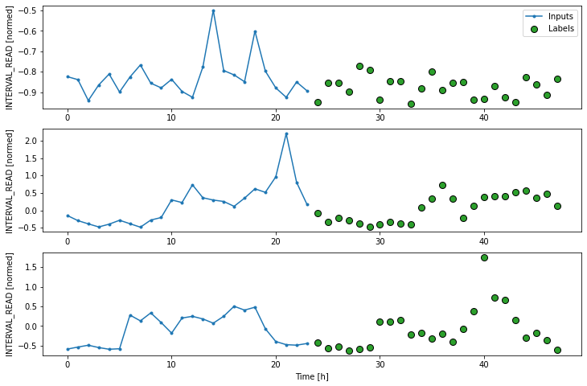
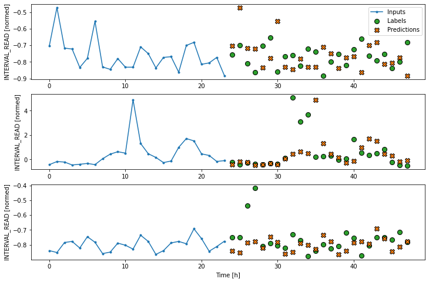
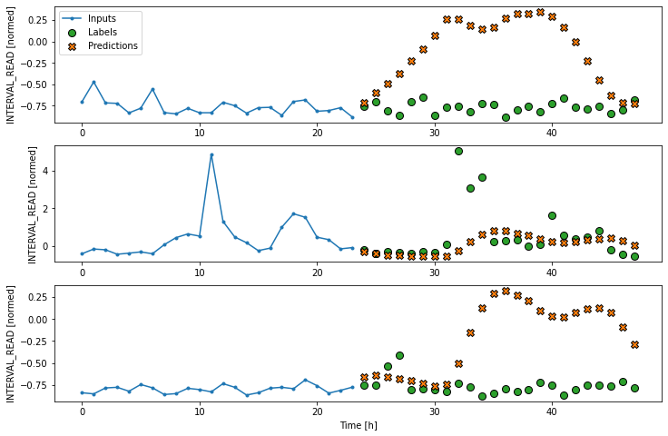
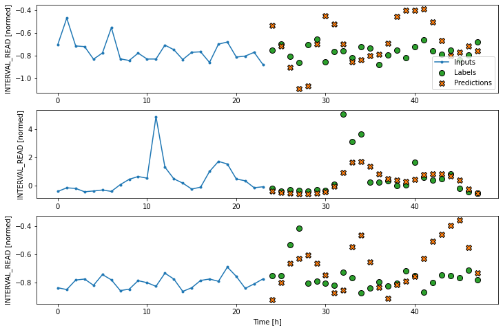
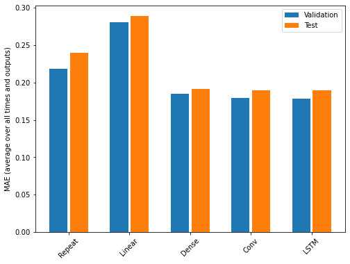

:::::::::::::::::::::::::::::::::::::: questions 

- How can forecast more than one timestep at a time?

::::::::::::::::::::::::::::::::::::::::::::::::

::::::::::::::::::::::::::::::::::::: objectives

- Explain how to create data windows and machine learning pipelines for 
forcasting multiple timesteps.

::::::::::::::::::::::::::::::::::::::::::::::::

## Introduction

In the previous section we developed models for making forecasts one timestep
into the future. Our data consist of hourly totals of power consumption
from a single smart meter, and most of the models were fitted using a one
hour input width to predict the next hour's power consumption. Recall that the
best performing model, the convolution neural network, differed in that the
model was fitted using a data window with a three hour input width. This implies
that, at least for our data, data windows with larger input widths may increase
the predictive power of the models.

In this section we will revisit the same models as before, only this time we
will revise our data windows to predict multiple timesteps. Specifically, we
will forecast a full day's worth of hourly power consumption based on the 
previous day's history. In terms of data window arguments, both the *input_width*
and the *label_width* will be equal to 24. 

## About the code

The code for this and other sections of this lesson is based on time-series
forecasting examples, tutorials, and other documentation available from 
the [TensorFlow](https://github.com/tensorflow/docs/blob/master/README.md) 
project. Per the documentation, materials available from the TensorFlow 
GitHub site published using an 
[Apache 2.0](https://github.com/tensorflow/docs/blob/master/LICENSE)
license.

> Google Inc. (2023) *TensorFlow Documentation.* Retrieved from [https://github.com/tensorflow/docs/blob/master/README.md](https://github.com/tensorflow/docs/blob/master/README.md).


## Set up the environment

As with the previous section, begin by importing libraries, reading data, and
defining the ```WindowGenerator``` class.

```python
import os
import IPython
import IPython.display
import matplotlib as mpl
import matplotlib.pyplot as plt
import numpy as np
import pandas as pd
import seaborn as sns
import tensorflow as tf
```

Read the data. These are the normalized training, validation, and test datasets
we created in the data windowing episode. In addition to being normalized, 
columns with non-numeric data types have been removed from the source data. 
Also, based on multiple iterations of the modeling process some additional, 
numeric columns were dropped. 

```python
train_df = pd.read_csv("../../data/training_df.csv")
val_df = pd.read_csv("../../data/val_df.csv")
test_df = pd.read_csv("../../data/test_df.csv")

column_indices = {name: i for i, name in enumerate(test_df.columns)}

print(train_df.info())
print(val_df.info())
print(test_df.info())
print(column_indices)
```

```output
<class 'pandas.core.frame.DataFrame'>
RangeIndex: 18396 entries, 0 to 18395
Data columns (total 5 columns):
 #   Column         Non-Null Count  Dtype  
---  ------         --------------  -----  
 0   INTERVAL_READ  18396 non-null  float64
 1   hour           18396 non-null  float64
 2   day_sin        18396 non-null  float64
 3   day_cos        18396 non-null  float64
 4   business_day   18396 non-null  float64
dtypes: float64(5)
memory usage: 718.7 KB
None

<class 'pandas.core.frame.DataFrame'>
RangeIndex: 5256 entries, 0 to 5255
Data columns (total 5 columns):
 #   Column         Non-Null Count  Dtype  
---  ------         --------------  -----  
 0   INTERVAL_READ  5256 non-null   float64
 1   hour           5256 non-null   float64
 2   day_sin        5256 non-null   float64
 3   day_cos        5256 non-null   float64
 4   business_day   5256 non-null   float64
dtypes: float64(5)
memory usage: 205.4 KB
None

<class 'pandas.core.frame.DataFrame'>
RangeIndex: 2628 entries, 0 to 2627
Data columns (total 5 columns):
 #   Column         Non-Null Count  Dtype  
---  ------         --------------  -----  
 0   INTERVAL_READ  2628 non-null   float64
 1   hour           2628 non-null   float64
 2   day_sin        2628 non-null   float64
 3   day_cos        2628 non-null   float64
 4   business_day   2628 non-null   float64
dtypes: float64(5)
memory usage: 102.8 KB
None

{'INTERVAL_READ': 0, 'hour': 1, 'day_sin': 2, 'day_cos': 3, 'business_day': 4}
```

Finally, create the ```WindowGenerator``` class.

```python
class WindowGenerator():
  def __init__(self, input_width, label_width, shift,
               train_df=train_df, val_df=val_df, test_df=test_df,
               label_columns=None):
    # Store the raw data.
    self.train_df = train_df
    self.val_df = val_df
    self.test_df = test_df

    # Work out the label column indices.
    self.label_columns = label_columns
    if label_columns is not None:
      self.label_columns_indices = {name: i for i, name in
                                    enumerate(label_columns)}
    self.column_indices = {name: i for i, name in
                           enumerate(train_df.columns)}

    # Work out the window parameters.
    self.input_width = input_width
    self.label_width = label_width
    self.shift = shift

    self.total_window_size = input_width + shift

    self.input_slice = slice(0, input_width)
    self.input_indices = np.arange(self.total_window_size)[self.input_slice]

    self.label_start = self.total_window_size - self.label_width
    self.labels_slice = slice(self.label_start, None)
    self.label_indices = np.arange(self.total_window_size)[self.labels_slice]


  def __repr__(self):
    return '\n'.join([
        f'Total window size: {self.total_window_size}',
        f'Input indices: {self.input_indices}',
        f'Label indices: {self.label_indices}',
        f'Label column name(s): {self.label_columns}'])


  def split_window(self, features):
    inputs = features[:, self.input_slice, :]
    labels = features[:, self.labels_slice, :]
    if self.label_columns is not None:
      labels = tf.stack(
          [labels[:, :, self.column_indices[name]] for name in self.label_columns],
          axis=-1)

    # Slicing doesn't preserve static shape information, so set the shapes
    # manually. This way the `tf.data.Datasets` are easier to inspect.
    inputs.set_shape([None, self.input_width, None])
    labels.set_shape([None, self.label_width, None])

    return inputs, labels

  
  def plot(self, model=None, plot_col='INTERVAL_READ', max_subplots=3):
    inputs, labels = self.example
    plt.figure(figsize=(12, 8))
    plot_col_index = self.column_indices[plot_col]
    max_n = min(max_subplots, len(inputs))
    for n in range(max_n):
      plt.subplot(max_n, 1, n+1)
      plt.ylabel(f'{plot_col} [normed]')
      plt.plot(self.input_indices, inputs[n, :, plot_col_index],
               label='Inputs', marker='.', zorder=-10)

      if self.label_columns:
        label_col_index = self.label_columns_indices.get(plot_col, None)
      else:
        label_col_index = plot_col_index

      if label_col_index is None:
        continue

      plt.scatter(self.label_indices, labels[n, :, label_col_index],
                  edgecolors='k', label='Labels', c='#2ca02c', s=64)
      if model is not None:
        predictions = model(inputs)
        plt.scatter(self.label_indices, predictions[n, :, label_col_index],
                    marker='X', edgecolors='k', label='Predictions',
                    c='#ff7f0e', s=64)

      if n == 0:
        plt.legend()

    plt.xlabel('Time [h]')
    

  def make_dataset(self, data):
    data = np.array(data, dtype=np.float32)
    ds = tf.keras.utils.timeseries_dataset_from_array(
        data=data,
        targets=None,
        sequence_length=self.total_window_size,
        sequence_stride=1,
        shuffle=True,
        batch_size=32)

    ds = ds.map(self.split_window)

    return ds


  @property
  def train(self):
    return self.make_dataset(self.train_df)

  @property
  def val(self):
    return self.make_dataset(self.val_df)

  @property
  def test(self):
    return self.make_dataset(self.test_df)

  @property
  def example(self):
    """Get and cache an example batch of `inputs, labels` for plotting."""
    result = getattr(self, '_example', None)
    if result is None:
      # No example batch was found, so get one from the `.train` dataset
      result = next(iter(self.train))
      # And cache it for next time
      self._example = result
    return result
```

## Create a multi-step data window

Create a data window that will forecast 24 timesteps (label_width), 24 hours
into the future (shift), based on 24 hours of history (input_width).

Since the value of the *label_width* and *shift* arguments are used to set
model parameters later, we will stored this value in a variable. This way, if
we want to test different label widths and shift values we only need to update
the *OUT_STEPS* variable.

```python
OUT_STEPS = 24
multi_window = WindowGenerator(input_width=24,
                               label_width=OUT_STEPS,
                               shift=OUT_STEPS)

print(multi_window)
```

```output
Total window size: 48
Input indices: [ 0  1  2  3  4  5  6  7  8  9 10 11 12 13 14 15 16 17 18 19 20 21 22 23]
Label indices: [24 25 26 27 28 29 30 31 32 33 34 35 36 37 38 39 40 41 42 43 44 45 46 47]
Label column name(s): None
```

We can plot the window to demonstrate the width of the inputs and labels. The 
labels are the actual values against which predictions will be evaluated. In the
plot below, we can see that windowed slices of the data consist of 24 inputs
and 24 labels.

Remember that our plots are rendered using an example set of three slices of
the training data, but the models will be fitted on the entire training 
dataframe.

```python
multi_window.plot()
```



## Create a baseline model

As we have done in previous lessons and sections of this lesson, we will create
a *naive seasonal* baseline forecast that is a subclass of the ```tf.keras.Model```
class. In this case, the values of the 24 input timesteps for each slice 
are used as the predictions for their corresponding label timesteps. This can
be seen in a plot of the model's predictions, in which the pattern or trend of
predicted values duplicates the pattern or trend of the input values.

```python
class RepeatBaseline(tf.keras.Model):
  def call(self, inputs):
    return inputs

repeat_baseline = RepeatBaseline()
repeat_baseline.compile(loss=tf.keras.losses.MeanSquaredError(),
                        metrics=[tf.keras.metrics.MeanAbsoluteError()])

multi_val_performance = {}
multi_performance = {}


multi_val_performance['Repeat'] = repeat_baseline.evaluate(multi_window.val)
multi_performance['Repeat'] = repeat_baseline.evaluate(multi_window.test, verbose=0)

print("Baseline performance against validation data:", multi_val_performance["Repeat"])
print("Baseline performance against test data:", multi_performance["Repeat"])

# add a plot
multi_window.plot(repeat_baseline)
```

```output
163/163 [==============================] - 1s 3ms/step - loss: 0.4627 - mean_absolute_error: 0.2183
Baseline performance against validation data: [0.46266090869903564, 0.218303844332695]
Baseline performance against test data: [0.5193880200386047, 0.23921075463294983]
```



We are now ready to train models. With the addition of creating layered
neural networks using the ```keras``` API, all of the models below will be 
fitted and evaluated using a workflow similar to that which we used for the
baseline model, above. Rather than repeat the same code multiple times, before
we go any further we will write a function to encapsulate the process.

The function adds some features to the workflow. As noted above, the loss 
function acts as a measure of the trade-off between computational costs and
accuracy. As the model is fitted, the loss function is used to monitor the
model's efficiency and provides the model an internal mechanism for determining
a stopping point. 

The ```compile()``` method is similar to the above, with the addition of an 
*optimizer* argument. The optimizer is an algorithm that determines the most
efficient weights for each feature as the model is fitted. In the current
example, we are using the ```Adam()``` optimizer that is included as part of
the default ```TensorFlow``` library.

Finally, the model is fit using the training dataframe. The data are split
using the data window specified in the positional *window* argument, in our
case the single step window defined above. Predictions are validated against
the validation data, with the process configured to halt at the point that
accuracy no longer improves. 

The *epochs* argument represented the number of times the that the model will
work through the entire training dataframe, provided it is not stopped before
it reaches that number by the loss function. Note that the MAX_EPOCHS is
being manually set in the code block below.

```python
MAX_EPOCHS = 20

def compile_and_fit(model, window, patience=2):
  early_stopping = tf.keras.callbacks.EarlyStopping(monitor='val_loss',
                                                    patience=patience,
                                                    mode='min')

  model.compile(loss=tf.keras.losses.MeanSquaredError(),
                optimizer=tf.keras.optimizers.Adam(),
                metrics=[tf.keras.metrics.MeanAbsoluteError()])

  history = model.fit(window.train, epochs=MAX_EPOCHS,
                      validation_data=window.val,
                      callbacks=[early_stopping])
  return history
```

With the data window and the ```compile_and_fit``` function in place, we can
fit and evaluate models as in the previous section, by stacking layers
of processes into a machine learning pipeline using the ```keras``` API.

## Multi step linear

Compared with the single step linear model, the model for forecasting multiple
timesteps requires some additional layers in order to flatten and reshape the
data. In the definition below, the first ```Lambda``` layer flattens the input
data using an inline function. The *units* argument in the ```Dense``` layer is
set dynamically, based on the product of the label_width and the number of 
features in the dataset. Finally, the model output is reshaped to match the
input data.

```python
num_features = train_df.shape[1]

multi_linear_model = tf.keras.Sequential([
    tf.keras.layers.Lambda(lambda x: x[:, -1:, :]),
    tf.keras.layers.Dense(OUT_STEPS*num_features,
                          kernel_initializer=tf.initializers.zeros()),
    tf.keras.layers.Reshape([OUT_STEPS, num_features])
])

history = compile_and_fit(multi_linear_model, multi_window)

multi_val_performance['Linear'] = multi_linear_model.evaluate(multi_window.val)
multi_performance['Linear'] = multi_linear_model.evaluate(multi_window.test, verbose=0)

print("Linear performance against validation data:", multi_val_performance["Linear"])
print("Linear performance against test data:", multi_performance["Linear"])

# add a plot
multi_window.plot(multi_linear_model)
```

```output
Epoch 10/20
574/574 [==============================] - 1s 1ms/step - loss: 0.3417 - mean_absolute_error: 0.2890 - val_loss: 0.3035 - val_mean_absolute_error: 0.2805
163/163 [==============================] - 0s 929us/step - loss: 0.3035 - mean_absolute_error: 0.2805
Linear performance against validation data: [0.30350184440612793, 0.28051623702049255]
Linear performance against test data: [0.339562326669693, 0.28846967220306396]
```




## Dense neural network


```python
multi_dense_model = tf.keras.Sequential([
    tf.keras.layers.Lambda(lambda x: x[:, -1:, :]),
    tf.keras.layers.Dense(512, activation='relu'),
    tf.keras.layers.Dense(OUT_STEPS*num_features,
                          kernel_initializer=tf.initializers.zeros()),
    tf.keras.layers.Reshape([OUT_STEPS, num_features])
])

history = compile_and_fit(multi_dense_model, multi_window)

multi_val_performance['Dense'] = multi_dense_model.evaluate(multi_window.val)
multi_performance['Dense'] = multi_dense_model.evaluate(multi_window.test, verbose=0)

print("Dense performance against validation data:", multi_val_performance["Dense"])
print("Dense performance against test data:", multi_performance["Dense"])
```

```output
Epoch 19/20
574/574 [==============================] - 3s 5ms/step - loss: 0.2305 - mean_absolute_error: 0.1907 - val_loss: 0.2058 - val_mean_absolute_error: 0.1846
163/163 [==============================] - 1s 3ms/step - loss: 0.2058 - mean_absolute_error: 0.1846
Dense performance against validation data: [0.2058122605085373, 0.184647798538208]
Dense performance against test data: [0.22725100815296173, 0.19131870567798615]
```

And plot:

```python
multi_window.plot(multi_dense_model)
```


## Convolution neural network

```python
CONV_WIDTH = 3
multi_conv_model = tf.keras.Sequential([
    tf.keras.layers.Lambda(lambda x: x[:, -CONV_WIDTH:, :]),
    tf.keras.layers.Conv1D(256, activation='relu', kernel_size=(CONV_WIDTH)),
    tf.keras.layers.Dense(OUT_STEPS*num_features,
                          kernel_initializer=tf.initializers.zeros()),
    tf.keras.layers.Reshape([OUT_STEPS, num_features])
])

history = compile_and_fit(multi_conv_model, multi_window)

multi_val_performance['Conv'] = multi_conv_model.evaluate(multi_window.val)
multi_performance['Conv'] = multi_conv_model.evaluate(multi_window.test, verbose=0)

print("CNN performance against validation data:", multi_val_performance["Conv"])
print("CNN performance against test data:", multi_performance["Conv"])
```

```output
Epoch 17/20
574/574 [==============================] - 1s 2ms/step - loss: 0.2273 - mean_absolute_error: 0.1913 - val_loss: 0.2004 - val_mean_absolute_error: 0.1791
163/163 [==============================] - 0s 1ms/step - loss: 0.2004 - mean_absolute_error: 0.1791
CNN performance against validation data: [0.20042525231838226, 0.17912138998508453]
CNN performance against test data: [0.2245914489030838, 0.18907274305820465]
```

And plot:

```python
multi_window.plot(multi_conv_model)
```


## Recurrent neural network (LSTM)

```python
multi_lstm_model = tf.keras.Sequential([
    tf.keras.layers.LSTM(32, return_sequences=False),
    tf.keras.layers.Dense(OUT_STEPS*num_features,
                          kernel_initializer=tf.initializers.zeros()),
    tf.keras.layers.Reshape([OUT_STEPS, num_features])
])

history = compile_and_fit(multi_lstm_model, multi_window)


multi_val_performance['LSTM'] = multi_lstm_model.evaluate(multi_window.val)
multi_performance['LSTM'] = multi_lstm_model.evaluate(multi_window.test, verbose=0)

print("LSTM performance against validation data:", multi_val_performance["LSTM"])
print("LSTM performance against test data:", multi_performance["LSTM"])
```

```ouput
Epoch 20/20
574/574 [==============================] - 5s 9ms/step - loss: 0.1990 - mean_absolute_error: 0.1895 - val_loss: 0.1760 - val_mean_absolute_error: 0.1786
163/163 [==============================] - 1s 3ms/step - loss: 0.1760 - mean_absolute_error: 0.1786
LSTM performance against validation data: [0.17599913477897644, 0.17859137058258057]
LSTM performance against test data: [0.19873034954071045, 0.18935032188892365]
```

And plot:

```python
multi_window.plot(multi_lstm_model)
```



## Evaluate

```python
for name, value in multi_performance.items():
  print(f'{name:8s}: {value[1]:0.4f}')
```

```output
Repeat  : 0.2392
Linear  : 0.2885
Dense   : 0.1913
Conv    : 0.1891
LSTM    : 0.1894
```

Plot MAE on validation and test dataframes.

```python
x = np.arange(len(multi_performance))
width = 0.3

metric_name = 'mean_absolute_error'
metric_index = multi_lstm_model.metrics_names.index('mean_absolute_error')
val_mae = [v[metric_index] for v in multi_val_performance.values()]
test_mae = [v[metric_index] for v in multi_performance.values()]

plt.bar(x - 0.17, val_mae, width, label='Validation')
plt.bar(x + 0.17, test_mae, width, label='Test')
plt.xticks(ticks=x, labels=multi_performance.keys(),
           rotation=45)
plt.ylabel(f'MAE (average over all times and outputs)')
_ = plt.legend()
```



::::::::::::::::::::::::::::::::::::: keypoints 

- If a *label_columns* argument is not provided, the data window will 
forecast all features.

::::::::::::::::::::::::::::::::::::::::::::::::

